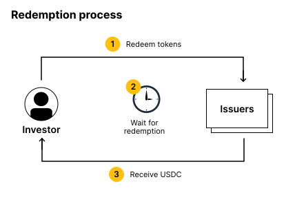
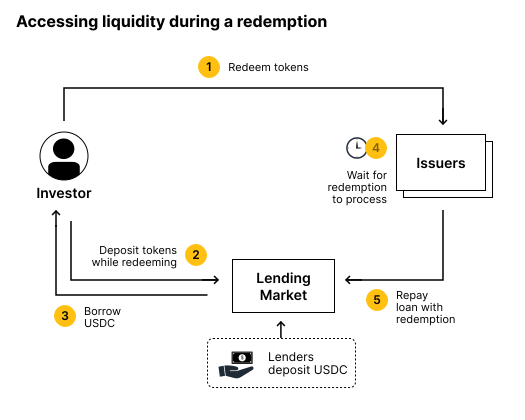

# CP103: Launch an RWA Lending Market
## Short Summary
Centrifuge should create an RWA focused lending market to give users the ability to lend and borrow against eligible pool tokens. This brings additional utility to RWAs and helps achieve our goal of bringing financial markets onchain.

## High-level Objective
Composability with DeFi protocols and giving RWAs onchain utility is a vital part of what’s needed for a thriving RWA ecosystem. Centrifuge worked closely with MakerDAO to onboard RWAs as collateral to DAI and later on launched the RWA Market with Aave as the first onchain lending market.

Centrifuge Pools are a great way for primary issuers to bring products onchain. Often requested features by holders of these tokens are:

1) Leverage in the form of being able to borrow against these assets
2) Short-term liquidity while redemptions are processed.

We propose to deploy a lending market for Centrifuge RWA assets built on Base. We see Base as an ideal blockchain to build on because of Coinbase attestations that allow for very easy access control to the market.

## Background
### Market Structure for Financial Products
Financial products benefit from having a robust market infrastructure. Financial products are more useful to owners if they have access to short them, to leverage, or to get immediate liquidity. In the long run DeFi primitives can offer a lot of these functions not just to crypto native tokens but also RWAs. This proposal is a major move in this direction.

For example, while Treasuries onchain are an exciting development in DeFi becoming more mature, these instruments lack the utility they would in TradFi. Shorting Treasuries is something anyone can do from their brokerage account, or offered via ETFs. Posting Treasuries as collateral for leverage is also widely utilized as your collateral grows over time helping prevent liquidation events. Additionally, borrowing against Treasuries for instant liquidity is common, especially for those in leveraged or low liquidity positions. DeFi users also don’t have the ability to speculate on rate changes as you would in TradFi, most commonly used to hedge interest rate exposure through options or interest rate swaps. Yes, vanilla real-world assets are being bridged onchain, but they lack all of the utility that these assets come with in the traditional world. Users can’t hedge, speculate, borrow, or service their liquidity needs with or on RWAs today. If DeFi wants to expand to institutions, the key infrastructure they already enjoy needs to be here first.

### Review of the RWA Market with Aave
Centrifuge DAO members and Aave jointly worked on the RWA Market, a separate deployment of the Aave lending market that accepted different Tinlake pools. The Aave Request for Comments has a lot of details on the original design. The market was the first of its kind and pioneered this structure. At the peak, the market grew close to $18M in total assets. However its use has declined for a few reasons:

* The interest rate relative to other DeFi rates was too low
* Onboarding to the market was cumbersome and slow
* The market couldn’t always promise liquidity because the underlying assets had long redemption periods.

This proposal makes a few improvements over the original design of the Aave RWA Market that we believe serves the user needs of today:

* Require highly liquid underlying collateral (nothing that has less than 7 day liquidity or liquid secondary markets that can step in when redemptions happen)
* Require isolated markets that give lenders better control over where they want to deploy liquidity
* Higher target interest rate
* More user friendly onboarding

## Creating a lending market for RWAs
### What are the use cases for lending markets?
There are a few reasons why users would want to borrow against RWAs, they ultimately fall into two categories:
1. Access liquidity when redeeming from the issuer: a need for immediate liquidity
2. Borrow cash while still earning interest on the underlying asset: this could be to get extra leverage, to short the borrowed asset, or if the market is unbalanced and rates are simply too low.

There are several benefits of supplying liquidity as a lender:
* Increased liquidity versus investing into the underlying asset
* Creating a market for instant redemptions can have higher yields

Creating access to instant liquidity on redemption
The current redemption process for pools on Centrifuge usually looks as follows:

Upon triggering a redemption there usually is a waiting period which even for the most liquid pool on Centrifuge today (currently Anemoy LTF) is during US market hours roughly 8 hours and more on weekends. Having 24/7 liquidity on these tokens is a huge benefit and looking at other products, something users are willing to pay a premium for.

Generally, issuers try to offer better liquidity by keeping some cash balance in the pool which is not ideal because it reduces yield for everyone else. Or they try to maintain credit lines themselves which is also costly. An open lending market means anyone can provide liquidity in these instances and available liquidity follows supply and demand.

Centrifuge should create a mechanism by which tokens can be put into redemption and used as collateral. This would allow a very simple process for any owners of pool tokens to get instant liquidity for tokens they want to redeem.

### Management of Market Parameters
The DAO should work to establish risk management processes for the market. As part of the implementation of this CP, a governance process for the market should be designed and implemented resulting in a future CP.

### Qualifying Collateral
Because the market needs high liquidity, the market should initially be limited to assets with high underlying liquidity that can reasonably redeem a large portion of the collateral in less than a week. The final collateral should be determined at launch.

### Legal Structure
The DAO instructs k/factory to research and design an appropriate legal structure for the lending market that protects lenders and creates an operating framework for all participants ensuring institutional users are able to interface with this vault. It instructs the k/factory to set up any necessary legal entities and report on its progress. The legal structure chosen for this has a few objectives as listed below:

It is important to prevent sanctioned entities and persons from interacting with the market. Complex onboarding requirements are a big hurdle for users to use the market so ideally we can allow any users with existing KYC and verifiable credentials to use the market. With over 125M accounts on Coinbase, we can use their Attestations on Base to allow fast (one-click) and safe onboarding for a large group of potential users.

The legal entity we will set-up will be a bankruptcy remote special purpose vehicle.

## Technical Design
### Choice of lending protocol
After evaluating different lending protocols (Aave, Compound, Euler and Morpho), the initial recommendation is to adapt Morpho and build on Morpho Blue and Metamorpho. Morpho recently [passed a proposal](https://snapshot.org/#/morpho.eth/proposal/0xfdabf7dd37ba8f0d304842690edf3a6638743194bcf8e39e485ac8e0720258ea) to deploy on Base which was a prerequisite for consideration. This proposal is to deploy with Morpho because of the following benefits:
* Isolated markets means that it’s easy to segregate this market and not have depositors and lenders for other assets mixed.
* Isolating this market is also required for legal reasons because most RWAs are permissioned tokens and require onboarding by counterparties.
* The permissionless ability to launch new markets means no complicated forking has to take place and there isn’t a new codebase that has to be maintained by us. See the Morpho Blue documentation.
* The Metamorpho Vault concept means the Centrifuge DAO could create a vault and support setting parameters and aggregating liquidity. See MetaMorpho documentation.
* With currently over $500M in deposits and over $250M in borrows, Morpho is battle tested and has an active user base.
* Morpho Blue is already been used for RWA assets namely IB01 and mTBILL and is particularly well suited for their custom set-up

### Permissioning the market
The market requires permissioning of lenders, borrowers and liquidators. This can be achieved by wrapping the lending asset (USDC) into wrapped UDSC that enforces permissioning on wrap/unwrap and transfer.
### Creating a redemption wrapper
The current implementation of Centrifuge requires the pool tokens to move into the redemption contract when an investor decides to redeem and as such using them as collateral is not possible without an additional smart contract. To launch the market, a wrapper contract has to be built that mints a token to be used as collateral in the market for every token the investor submits for redemption. Upon redemption, the wrapped token has to be able to get converted into USDC.
### Deploying on Base
While not a strict requirement, deploying this market on Base has several benefits; Centrifuge is already live, it has low transaction fees and most importantly, it allows the seamless integration of Coinbase attestations.

An alternative would be to use a message bridge to make Coinbase attestations available on mainnet.

## Funding Request
This proposal requests funding from the DAO treasury to implement this market and has the following initial funding request.

| Name | Description | Budget |
|-|-|-|
| Creation of DAO controlled foundation | Establish a Cayman foundation controlled by the DAO | $60’000 |
| Research and develop legal structure for market | | $150’000
| Risk assessment and market management | Engage DeFi and TradFi experts to come up with the appropriate initial market parameters and create an ongoing process to manage the market in the DAO. | $80’000 |
| Smart contract development | Develop smart contracts to create permissioning features and integrate with a lending market. | $75’000 |
| Code Audits | Security audit of the smart contracts | $40’000 |
| | Total | $405’000 |

The EMA 7 days price for CFG is 0.669, thus the request for this proposal from the treasury is 606,000 CFG. Any extra funds (unused) after converting, if the proposal passes, would be returned to the Centrifuge Treasury account in 14 days. 

The proposal requests these funds to be transferred to this wallet: `4d9knu1Wnr5mai3SJoGnfKethQE1TB997D7qPuvZq4NR93LM`.

## Alignment to the mission of Centrifuge DAO
This proposal to build lending infrastructure for LTF and other liquid RWA tokens on Centrifuge. It’s the first step in giving utility to these tokens, but also RWAs as a whole regardless of asset class. Treasury tokens are a clear first asset class to build utility around as they have the most opportunity for DeFi composability, and the most use cases due to their riskless and stable nature as well as high liquidity.

Building infrastructure around Centrifuge issued tokens is a key advantage for us over other RWA protocols as they stand today. It serves as a crucial selling point for institutions coming onchain who already have utility with their assets. Infrastructure is also what will allow our DeFi native users to utilize their RWAs as they would with their crypto native assets. All of this serves the purpose of helping grow the TVL of Centrifuge, and maintaining our position as the largest RWA protocol.

Link to the RFC on the Forum: https://gov.centrifuge.io/t/cp103-launch-an-rwa-lending-market/6346

Link to the Opensquare Snapshot: https://voting.opensquare.io/p/205

Link to the onchain vote: https://centrifuge.subsquare.io/council/motions/93