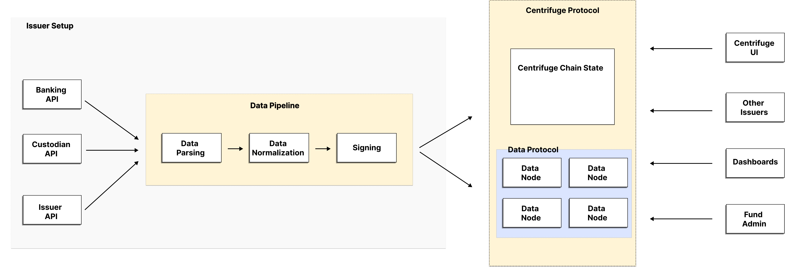
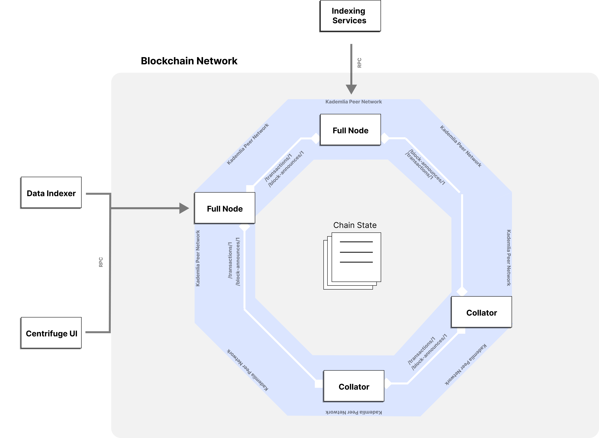
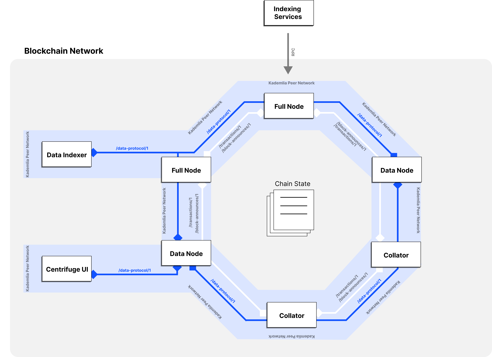

## Short Summary 
Proposal to introduce the Data Protocol, a further development of the Private Offchain Data (POD) within the Centrifuge network, enabling secure data storage, collaboration, and sharing functionalities. This protocol aims to establish Centrifuge as the single source of truth for issuers, facilitating transparent and compliant operations while enabling data-driven decision-making for managers and investors.

## High level objective 
The primary aim of this proposal is to address a critical need within the Centrifuge network, namely, the accessibility of asset information such as asset paperwork to various service providers and investors participating in pools on Centrifuge. Due to scalability limitations and privacy concerns, this data cannot feasibly reside solely onchain. Therefore, we propose the implementation of a comprehensive data protocol that enables secure storage, collaboration, and sharing of documents among network participants. By facilitating the dissemination of such critical data via a P2P network across different nodes, Centrifuge endeavors to empower users while ensuring transparency, compliance, and informed decision-making throughout the ecosystem.




## Background 
In the evolving landscape of decentralized finance (DeFi), the need for robust solutions for secure data management is paramount. The introduction of the Data Protocol aligns with Centrifuge DAO's mission to provide decentralized and secure solutions for the finance industry. By enabling Centrifuge to become the single source of truth for issuers, the protocol addresses the growing demand for transparent and compliant operations while empowering managers and investors with data-driven insights.

## Description of Activity 
The proposed Data Protocol introduces a comprehensive framework for managing documents within the Centrifuge 
network. At its core, the protocol enables users to securely store, collaborate on, and share documents while ensuring data integrity and privacy.

### Key features of the Data Protocol include:
  - Secure Data Storage: Issuers can securely store trades/settlements data, investor KYC information, transaction lists, and descriptive reasoning for onchain actions on the data nodes, ensuring confidentiality and integrity of sensitive data.
  - Data Sharing: Service providers and other involved parties can access and verify data, including public onchain data and both public and private data node data, enabling transparent and compliant operations.
  - Collaborative Sign-offs: Document collaborators - such as issuers and administrators - agree on the state of documents stored in the data nodes, providing a record trail of actions that all collaboratirs rely on. Auditors and investors can track these commitments, ensuring transparency and accountability.
  - Document Anchoring: Documents are anchored on the Centrifuge blockchain, providing a verifiable record of changes.
  - Message Exchange: The protocol defines a set of messages exchanged in the P2P network, including Create-Document-Request, Read-Document-Request, Update-Document-Request and Delete-Document-Request.
  - Document Formats: The protocol specifies a general document format that all documents must adhere to, as well as specific formats for pool configuration and asset documents.
  - Ecosystem of Normalized Data: The protocol fosters an ecosystem of normalized data, enabling the tracking of issuer and asset performances.
  - Syncing Behavior: Nodes are instructed on how to behave when syncing documents with other data nodes, ensuring consistency, reliability and data availability.

### Technical Details
The implementation of the Data Protocol will encompass both technical specifications and integration with existing Centrifuge components, with pertinent resources hosted on GitHub repositories. Here's a concise overview of the proposed changes from a technical standpoint.

#### Versioning
The data protocol will undergo versioning to facilitate ongoing improvements and updates. This CP pertains to the general structure of the data protocol, focusing specifically on version 1 of the protocol. It is anticipated that the general structure of the data protocol will remain relatively consistent across versions. Changes in protocol versions are expected to primarily affect the messages exchanged within the protocol and their respective content. Furthermore, modifications in document formats are anticipated between versions, which may involve the addition of new formats, alterations to existing fields, and adjustments in the interpretation of document field content.

Implementation of the protocol should prioritize supporting multiple versions to enable a gradual phase-out of older versions over time.

#### Architectural Changes
The Centrifuge network comprises various participants, including indexing services such as subscan, data indexers like subquery and dune, and UI interfaces like the Centrifuge UI. These entities interact with the network via web2 interfaces primarily utilizing RPC calls, serving as external interfaces to the blockchain network through full nodes. Additionally, participants within the Centrifuge network include light clients, collators, and full nodes, constituting the actual blockchain network participants.



To seamlessly integrate the data protocol into the network infrastructure, we'll introduce data nodes—entities embedded within the blockchain network capable of communicating via the data protocol. Essentially, the data protocol operates as an application layer protocol within the blockchain network.
In a bid to enhance integration with data nodes, data indexers, and UIs, we'll adapt these services to become part of the blockchain network. This modification enables them to communicate directly with data nodes via P2P communication, thereby enhancing their resilience.
Adopting a protocol-based approach offers significant advantages over traditional RPC services. It facilitates broader accessibility, allowing any entity interested in communicating with data nodes to implement the protocol, thereby promoting interoperability without mandating specific implementations.



#### Document Formats
Documents within the Centrifuge network will adopt a structured format represented as JSON files. Each document will conform to a standardized framework known as the general document structure, comprising three primary sections: the header, the preamble, and the content.

The following shows a first draft of the general document format:
```json=
{
    "header": {
        "documentType": {
            "name": String,
            "version": u32
        },
        "collaborators": [
            {
             "name": String, 
             "account": [u8; 32],
            }
        ],
        "current_version": u32,
        "versions": [
            {
              "version": u32,
              "signOffs": [
                  {
                      "account": [u8; 32],
                      "documentHash": [u8; 32],
                      "commitment:": StorageProof
                  }
              ]
            }
        ]
    },
    "preamble": {
        "signOffs": [
            {
               "account": [u8; 32],
               "commitment:": StorageProof
            }
        ]
    },
    "content": {
        ...
    }
}
```

The header section will contain comprehensive information about the document, including its type (such as pool configuration document or asset document), details regarding collaborators, previous versions, respective hashes and storage proofs.

In the preamble section, the essential onchain proofs of collaborators for the current version will be stored.

The content section of each document will vary depending on its type, with specific formats yet to be determined for both pool configuration documents and asset documents.

#### Runtime Changes
Data nodes will require the ability to verify anchors made by users on-chain. To facilitate this, the Centrifuge runtime will expose a runtime API for anchor verification. Leveraging runtime APIs offers compatibility with light clients and avoids dependencies on specific storage locations, empowering runtimes to provide flexible implementations.

```rust=
decl_runtime_apis! {

    pub trait Anchors<AccountId, Hash>
    where
        AccountId: Codec
        Hash: Codec
    {
        fn anchored(by: AccountId, what: Hash) -> bool;
    }
}
```
## Change or improvement 
The introduction of the Data Protocol represents a significant improvement to the Centrifuge network, enhancing its capabilities for secure data management, collaboration, and sharing. By enabling Centrifuge to become the single source of truth for issuers, the protocol ensures transparency, compliance, and data-driven decision-making across the ecosystem.

## Responsible
The k/f team is responsible for the implementation and integration of the Data Protocol within the Centrifuge network.

## Alignment to the mission of Centrifuge DAO 
The Data Protocol aligns perfectly with Centrifuge DAO's mission to provide decentralized and secure solutions for data management. By empowering Centrifuge to become the single source of truth for issuers, the protocol facilitates transparent and compliant operations while enabling data-driven decision-making for managers and investors, ultimately advancing the mission of decentralized finance.

Link to the RFC on the Forum: https://gov.centrifuge.io/t/rfc-data-protocol-technical-proposal/6344

Link to the Opensquare Snapshot: 

