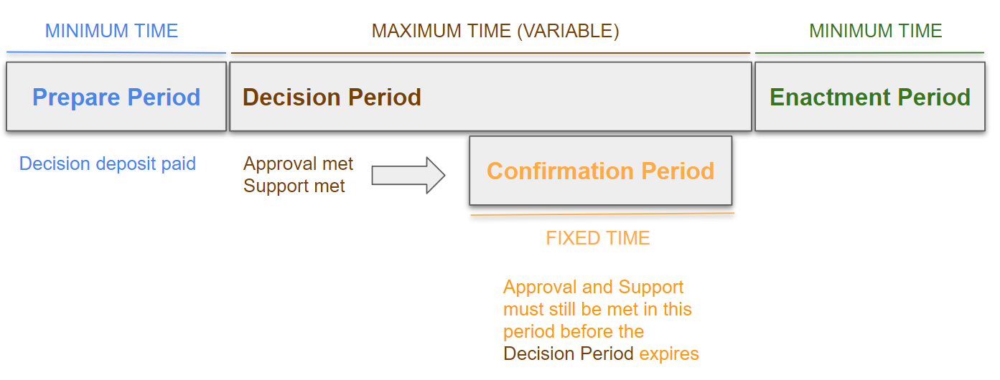
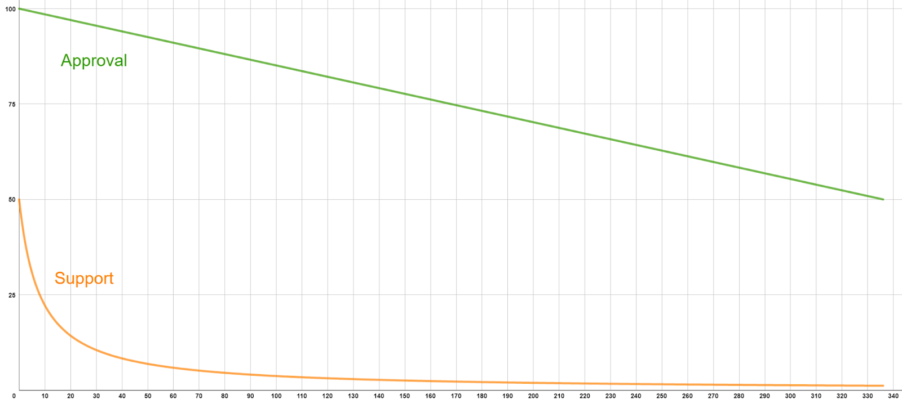
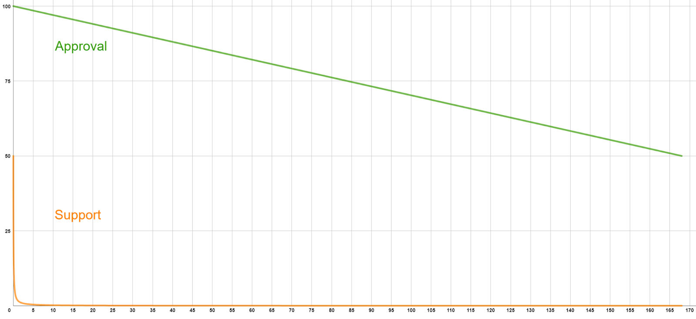
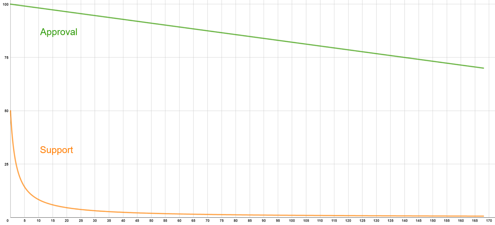
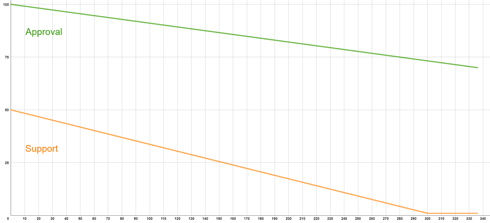
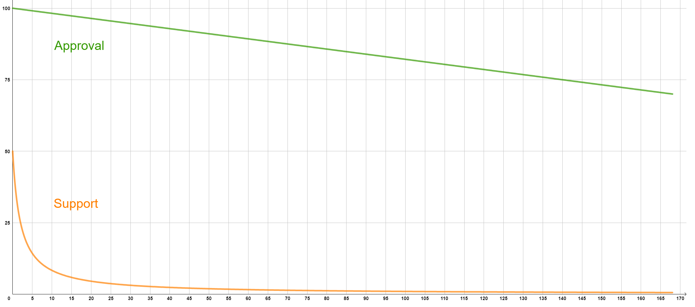

## Short Summary

Transition of our onchain governance from Gov1 to OpenGov and improve governance process.

---
## High-level objective

To make a soft transition to OpenGov - while keeping the Gov1 pallets (including the council) for a transition period of 3 months - using the tracks and parameters proposed below, based on the discussion [here](https://gov.centrifuge.io/t/discussion-about-migration-to-opengov/5578/16).

Also to improve our governance process by making the steps and templates more clear and consistent.

---
## Background

The onchain governance mechanism, Gov1, served as the established standard for both Kusama and Polkadot (and the parachains) until the introduction of OpenGov in November 2022 and June 2023, respectively. Subsequently, a number of parachains have also undergone migration. Sustaining Gov1 independently, without the support of the ecosystem, would necessitate a substantial allocation of engineering resources. Moreover, relying on a centralized collective, exemplified by the council, is not ideal either. So we would have to address these challenges at some stage.

---
## Description of Activity

The GCG proposes the following tracks and parameters for our OpenGov setup. The Whitelisted Caller track will be managed by a Technical Committee that will consist of people with knowledge and insight in the technical aspect of Centrifuge Chain. They will be a mandated group and a separate proposal will be made for their mandate request.

### Tracks
Below is an overview of the 6 suggested tracks and their descriptions.

|**Track**|**Description**|**Referendum examples**|
| --- | --- | --- |
|Root|Track with the highest privilege|Runtime upgrades, Technical Committee management|
|Whitelisted Caller|Track used for referenda that have been whitelisted by the Technical Committee and can execute with Root privileges|Fast-tracked operations|
|Pool Admin|Custom track for pool management|Launching a pool on Centrifuge|
|Treasurer|Track used for asking for funding from the treasury |Treasury proposal|
|Referendum Canceller|Track used for cancellation of incorrectly submitted referenda, Decision Deposit is refunded|Wrong referendum|
|Referendum Killer|Track used for killing malicious referenda, Decision Deposit is slashed|Malicious/harmful referendum|

All tracks follow this flow, but with different parameters:



### Electorate
We propose to exclude the [Treasury wallet](https://centrifuge.subscan.io/account/4dpEcgqJRyJK3J8Es6v8ZfVntV7c64Ysgcjd4hYwyGoFPWbg) (currently ~15.2M CFG) from the electorate. Given the only current inflation comes from block rewards (~3% annually) - where the majority goes into the treasury - the only increase in the electorate should come from the amount that is paid out to collators from the block rewards.

### Parameters

Below are the parameters for each track, specification of Approval and Support and their curves. Click on the arrows to expand.

### Root

||**Max Deciding**|**Decision Deposit**|**Prepare Period**|**Decision Period**|**Confirmation Period**|**Enactment Period**|
| --- | --- | --- | --- | --- | --- | --- |
| Root | 2 | 300,000 CFG | 6 hours | 14 days | 12 hours | 1 day |

Approval (linear): 100% -> 50%

Support (reciprocal): 50% -> 0.88%

<details>
 <summary>Click here for specification of Approval and Support over time</summary>

|Hours|Approval (linear)|Support (reciprocal)|
| --- | --- | --- | 
|0|100.00 %|50.00 %|
|1|99.85 %|42.86 %| 
|2|99.70 %|37.50 %|
|3|99.55 %|33.33 %|
|24|96.43 %|10.00 %|
|312|53.57 %|0.94 %| 
|324|51.79 %|0.91 %| 
|336 (14 days)|50.00 %|0.88 %|

</details>

<details>
 <summary>Click here to see the Approval and Support curves</summary>


</details>

### Whitelisted Caller

||**Max Deciding**|**Decision Deposit**|**Prepare Period**|**Decision Period**|**Confirmation Period**|**Enactment Period**|
| --- | --- | --- | --- | --- | --- | --- |
| Whitelisted Caller | 20 | 1,000 CFG | 10 minutes | 7 days | 10 minutes | 10 minutes |

Approval (linear): 100% -> 50%

Support (reciprocal): 50% -> 0.01%

<details>
 <summary>Click here for specification of Approval and Support over time</summary>

|Hours|Approval (linear)|Support (reciprocal)|
| --- | --- | --- |
|0|100.00 %|50.00 %|
|1| 99.70 %|1.92 %|
|2|99.40 %|0.98 %| 
|3|99.11 %|0.66 %|
|24|92.86 %|0.08 %| 
|72|78.57 %|0.03 %| 
|120|64.29 %|0.02 %| 
|168 (7 days)|50.00 %|0.01 %| 

</details>

<details>
 <summary>Click here to see the Approval and Support curves</summary>



</details>

### Pool Admin

||**Max Deciding**|**Decision Deposit**|**Prepare Period**|**Decision Period**|**Confirmation Period**|**Enactment Period**|
| --- | --- | --- | --- | --- | --- | --- |
| Pool Admin | 5 | 1,000 CFG | 1 hour | 7 days | 1 hour | 1 hour |

Approval (linear): 100% -> 70%

Support (reciprocal): 50% -> 0.59%

<details>
 <summary>Click here for specification of Approval and Support over time</summary>

|Hours|Approval (linear)|Support (reciprocal)|
| --- | --- | --- |
|0|100.00 %|50.00 %|
|1| 99.82 %|33.33 %| 
|2|99.64 %|25.00 %| 
|3|99.46 %|20.00 %| 
|24|95.71 %|3.85 %| 
|72|87.14 %|1.35 %| 
|120|78.57 %|0.82 %| 
|168 (7 days)|70.00 %|0.59 %| 

</details>

<details>
 <summary>Click here to see the Approval and Support curves</summary>



</details>

### Treasurer

||**Max Deciding**|**Decision Deposit**|**Prepare Period**|**Decision Period**|**Confirmation Period**|**Enactment Period**|
| --- | --- | --- | --- | --- | --- | --- |
| Treasurer | 2 | 10,000 CFG | 6 hours | 14 days | 12 hours | 12 hours |

Approval (linear): 100% -> 70%

Support (piece wise linear): 50% -> 1%

<details>
 <summary>Click here for specification of Approval and Support over time</summary>

|Hours|Approval (linear)|Support (reciprocal)|
| --- | --- | --- |
|0|100.00 %|50.00 %|
|1|99.91 %|49.84 %| 
|2|99.82 %|49.67 %| 
|3|99.73 %|49.51 %| 
|24|97.86 %|46.08 %| 
|312|73.21 %|1.00 %|
|324|71.07 %|1.00 %|
|336 (14 days)|70.00 %|1.00 %|


</details>

<details>
 <summary>Click here to see the Approval and Support curves</summary>



</details>

### Referendum Canceller

||**Max Deciding**|**Decision Deposit**|**Prepare Period**|**Decision Period**|**Confirmation Period**|**Enactment Period**|
| --- | --- | --- | --- | --- | --- | --- |
| Referendum Canceller | 20 | 50,000 CFG | 1 hour | 7 days | 1 hour | 10 minutes |

Approval (linear): 100% -> 70%

Support (reciprocal): 50% -> 0.59%

<details>
 <summary>Click here for specification of Approval and Support over time</summary>

|Hours|Approval (linear)|Support (reciprocal)|
| --- | --- | --- | 
|0|100.00 %|50.00 %|
|1| 99.82 %|33.33 %| 
|2|99.64 %|25.00 %| 
|3|99.46 %|20.00 %| 
|24|95.71 %|3.85 %| 
|72|87.14 %|1.35 %| 
|120|78.57 %|0.82 %| 
|168 (7 days)|70.00 %|0.59 %|

</details>

<details>
 <summary>Click here to see the Approval and Support curves</summary>


</details>

### Referendum Killer

||**Max Deciding**|**Decision Deposit**|**Prepare Period**|**Decision Period**|**Confirmation Period**|**Enactment Period**|
| --- | --- | --- | --- | --- | --- | --- |
|Referendum Killer|20|75,000 CFG|1 hour|7 days|1 hour|10 minutes|

Approval (linear): 100% -> 70%

Support (reciprocal): 50% -> 0.59%

<details>

<summary>Click here for specification of Approval and Support over time</summary>

|Hours|Approval (linear)|Support (reciprocal)|
| --- | --- | --- | 
|0|100.00 %|50.00 %|
|1| 99.82 %|33.33 %| 
|2|99.64 %|25.00 %| 
|3|99.46 %|20.00 %| 
|24|95.71 %|3.85 %| 
|72|87.14 %|1.35 %| 
|120|78.57 %|0.82 %|
|168 (7 days)|70.00 %|0.59 %| 


</details>

<details>

<summary>Click here to see the Approval and Support curves</summary>



</details>

## Changes to our governance process
In addition to the proposed parameters above, the following changes are also proposed to our governance process.

### Naming of CPs

Instead of using the RFC prefix in the forum post when the CP is created, e.g. `RFC: Centrifuge Migration to OpenGov`, use CPXXX, where XXX is the pull request # from the GitHub submission, e.g. `CP108: Centrifuge Migration to OpenGov`. This will require the CP to be submitted to GitHub **before** it is posted on the forum.

### Status of CPs

A CP can have the following status:

* `rfc`
* `voting`
* `passed` / `rejected`

This should be indicated the forum post’s **header** (see section below) and **tags** as well as on GitHub, as the CP progresses through the stages.

Other tags to include in the forum post is:

* tag of the component used (e.g. `cp1`, `cp2`, `cp3`, `cp4` etc.)
* tags specific for the CP (e.g. `runtime-upgrade`, `governance-process`, `pool-fees` etc.)

### Headers of CPs in forum posts + GitHub

To keep the forum post and the file on GitHub consistent, the same **standard header** should be used both places for **all** CPs:
```
cp: [XXX]
title:
authors: [forum handles]
contributors: [forum handles]
uses-component: [cp1|cp2|cp3|cp4|cp5|cp32|cp63]
technical proposal: [yes|no]
requires onchain: [yes|no]
status: [rfc|voting|passed|rejected]
date-proposed: [YYYY-MM-DD]
date-ended: [YYYY-MM-DD]
```
Note that it is possible to include more than one component in a CP, e.g. you can have a CP that uses both component CP2 and CP4 etc.

The CP2 component (Tresury proposals) should include two additional lines:

```
beneficiary: [name]
wallet: [wallet address]
```

### Adding new component 
[CP63](https://github.com/centrifuge/cps/blob/main/cps/CP63.md) should be added as a component to [CP0](https://github.com/centrifuge/cps/blob/main/cps/CP0/CP0.md).

--- 

## Change or improvement

This proposal, if passed, will make our onchain governance more decentralised, by removing the council so there are no entities that hold special powers over the network. 

The Centrifuge Treasury will also fully be in the hand of all token holders, rather than being administered by a council.

However, these changes will also mean that CFG token holders, as a collective, will have more responsibility in terms of actively voting on governance proposals. 

It will also bring more flexibility as it will allow us to 

- customise the lifecycle of each type of referendum
- delegate tokens to vote on specific tracks

Our governance process will also be more clear as there will be standard templates to use when creating a CP.

---
## Alignment to the mission of Centrifuge DAO

Given that Centrifuge operates as a decentralized organization, it is inherent that our governance aligns with this as well. The submission and outcome of all onchain proposals in OpenGov will be entirely in the hands of CFG token holders and not single entities.

---
## Next steps

After the RFC period, the proposal will be submitted to GitHub, followed by an Opensquare snapshot (offchain voting). If that vote passes, the migration will be included in an upcoming Runtime Upgrade with the defined tracks and parameters. The Runtime Upgrade will most likely happen sometime in the beginning of Q3 2024.

If the proposal passes, the following tasks will need to be done asap post-migration:

* Notify [SubSquare](https://centrifuge.subsquare.io/) to update the UI to support OpenGov referenda
* Notify [Subscan](https://centrifuge.subscan.io/) to update the UI to support OpenGov referenda
* Notify Nova Wallet to update the UI to support OpenGov referenda
* Update governance documentation based on the above changes
---

Link to the RFC on the Forum: https://gov.centrifuge.io/t/rfc-centrifuge-migration-to-opengov/5984

Link to the Opensquare Snapshot: 