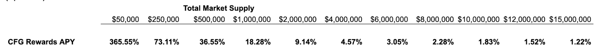

```
cp: 116
Title: RWA Lending Market Liquidity Bootstrap
authors: @Imdior, @GraysonAlto
uses-component: cp4, cp2
technical-proposal: yes
requires-onchain: yes
beneficiary: Contract Wallet Address
wallet: [4eEqmbQMbFfNUg6bQnqi9zgUvQvSpNbUgstEM64Xq9FW58Xv]
impacts/modifies: -
status: rfc
date-proposed: 2024-06-21
```

### Short Summary

Initiate bootstrap incentive rewards liquidity for the RWA Lending Market on Morpho

### High level objective

This proposal is for providing 60,000 CFG incentive rewards to be distributed as rewards for the RWA Lending Market. These rewards will last for 60 days following the launch of the LTF/USDC pair.

### Background

The [CP103: Launch an RWA Lending Market](https://github.com/centrifuge/cps/blob/main/cps/CP103/CP103.md) on Morpho was recently approved by the Centrifuge DAO.
The bootstrap liquidity is critical during the launch and in order to attract lenders.

### Description of Activity

This proposal covers the first 2 months of the initiative, based on the planned amount of CFG to be supplied (1000 CFG per day). It is important to note that lenders in the market not only earn CFG rewards, but baseline borrow interest, and MORPHO token rewards as well.

The following table shows what SOLELY CFG reward APYs would look like based on the amount of total market supply. This is at the current price at the time of writing of $0.46 per CFG.


Please keep in mind that this is a fixed rate supplied per day, so naturally, the overall reward decreases linearly as TVL increases. A fixed rate per day is the default and recommended structure from Morpho.

### Change or improvement

1. Initiate liquidity bootstrap and provide 60,000 CFG for 60 days once the market launches and deposit these rewards into the RWA Lending Market on the Morpho Rewards Distributor Contract [ 4eEqmbQMbFfNUg6bQnqi9zgUvQvSpNbUgstEM64Xq9FW58Xv ].

2. Distribute 1000 CFG per day as rewards across the RWA Lending Market on Morpho.

### Alignment to the mission of Centrifuge DAO

By creating early liquidity incentives, we will bootstrap early participation in the market which will attract more lenders, borrowers and issuers. By capping the token rewards, we're limiting the Centrifuge out of pocket cost, while still supporting the initiatives that will help us build key infrastructure around Centrifuge. All of this serves the purpose of helping grow the TVL of Centrifuge, and maintaining our position as the largest RWA protocol.
