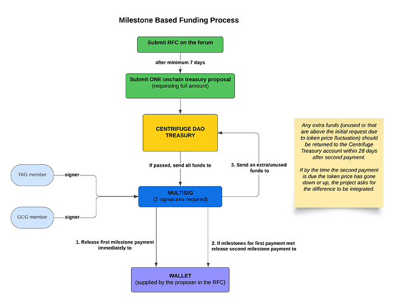

## Short Summary

Making amendments to the CP2 component (used for funding requests).

## High level objective

To improve the management efficiency and effectiveness of the DAO's treasury by modifying the CP2 component provided for proposers requesting funds from CentrifugeDAO. With this new arrangement, we aim to create a more accountable, risk-free, and robust process.

## Background

The proposed amendments to the CP2 component in CP128 are built upon the historical context and principles established in [CP107](https://github.com/centrifuge/cps/blob/main/cps/CP107.md), "Updated Treasury Spending Agreement,". This proposal is relevant and aligned with the mission of Centrifuge DAO for several key reasons:

1. Conservative Spending: CP107 reaffirmed the DAO's commitment to cautious and conservative spending of the onchain Treasury funds. This principle remains fundamental to CP128's proposed changes, ensuring responsible management of resources.
2. Treasury Growth: Since the implementation of CP6, which initiated block rewards accumulation, the onchain Treasury has grown to approximately 9,931,100 CFG. This significant growth necessitates a more structured approach to fund allocation, which CP128 aims to address.
3. Learning from Other DAOs: CP107 stressed the importance of learning from the mistakes of other DAOs to spend Treasury funds more wisely. CP128's proposed Milestone-Based Funding system for larger requests aligns with this principle, introducing measures to mitigate risks associated with substantial fund allocations.
4. Call for Expert Guidance: CP107 suggested establishing a Resource and Treasury

By building upon these historical and contextual factors established in CP107, the amendments proposed in CP128 aim to enhance the efficiency, accountability, and risk management of the DAO's treasury spending, thereby aligning closely with Centrifuge DAO's mission of responsible and impactful resource utilization.

## Description of Activity

We propose to modify the request for funding process as follows to improve and enhance it. The changed and added parts are highlighted.

Additionally, we propose to implement a Milestone-Based Funding system for proposals requesting funds over $50,000.


**Template:**

```
Short Summary
- One sentence summary describing the project for which funding is sought

High level objective
- A short description of the objective that this proposal will achieve

Background of Proposal
- What are the historical and contextual factors that make this proposal relevant and aligned with the mission?

Description of Activity
- Provide a detailed description of the activity that will be undertaken

Risk Assessment
- Describe the potential risks of the project?
- How do you plan to manage these risks?

Sustainability
- Describe how the project will be sustained after completion?
- Will additional funding be needed in the future?

Collaborations and Partnerships
- Will the project involve cooperation with other groups or DAOs?

Change or improvement
- What is the change or improvement that this mandate will bring?

Alignment to the mission of Centrifuge DAO
- Explain why this is important and aligned with the mission
- How will this project affect the DAO community?

Description of Individual/Group seeking funding
- Detail the roles and responsibilities of each member
- Provide backgrounds of each of the member(s) of the group seeking funding
- Supply DIDs of each member
- Supply evidence of work via social media links for each member

Budget
- Describe in detail the amount requested and how is it calculated
- How are the funds distributed within the group?

Measurement and Evaluation
- How will you measure the success of the project?
- List the key performance indicators (KPIs).

Delivery and Reporting
- Show a timeline of when the objective(s) will be delivered and how this will be reported

Legal and Ethical Considerations
- Does the project have any legal or ethical issues?
- How will you address them?
```

If the proposal asks for funds over $50,000, then milestone-based funding applies as below:




**Goal:** Avoid mismanagement of funds by proposers. Establish a clear process and expectation that in order to receive funds from the Centrifuge Treasury, proof of delivery must be provided.

**Caveat:** Retroactive proposals do not apply. Retroactive funding is where the work has already been delivered and the proposal is asking for compensation to cover this work done.

**Milestone Based Payments**

If a proposal requests any amount over 50,000 USDC equivalent from the Centrifuge DAO Treasury then it must be paid out via two separate payments, based on completion of a milestone. The process for proposals requesting over 50,000 USDC is:

1. Submit ONE Request for Comment (RFC) and following that, ONE on-chain treasury proposal. These must detail how the project will be split into two milestones, including the estimated date for completion of the first milestones which must be measurable deliverables. For example if a proposal for 50,000 USD equivalent would be split into 2 payments of 25,000. The proposer must include all the deliverables for the first $25,000 milestone, the estimated date of completion and the same for the second $25,000 milestone. The more detail you supply on your milestones the better.
2. If the on-chain proposal passes, the total amount of requested tokens will be sent to a multi-signature wallet where at least one signer will be a member of the Treasury Advisory Group. The other signer(s) on the wallet will be a GCG member. (*We would like to get the DAO's feedback on this point. Having proposers in the multi-sig doesn't serve a purpose and can actually cause problems in some situations. However, having TAG alone isn't sufficient to adequately distribute authority and create decentralization. Therefore, it seemed more logical to include a GCG member, but this still concentrates power mostly on one side. An idea that emerged during our discussion was to include one of the active contributors. However, this also brings different challenges. We're awaiting the DAO's comments on this issue.)*
3. After the proposal has passed, the first milestone payment will be released immediately from this wallet to the address supplied by the proposer in their on-chain proposal.
5. For the second payment, a group of people that can act to verify the work was done and suggest inclusion of GCG and TAG. Signers will deem if the first milestones for payment have been sufficiently met. If yes, the second (and final) payment will be released to the supplied wallet. If there is no evidence that the first milestones have been completed (or if the submissions are not sufficient), the second payment will not be sent. On the other side, if anyone from the DAO expresses a negative opinion about the initial milestones, we can re-evaluate and potentially change the decision. Expert opinions can be sought for assessment of milestone completions. This process also aims to support people in delivering high-quality work.
6. Any extra funds (unused or that are above the initial request due to token price fluctuation) should be returned to the Centrifuge Treasury account in 28 days.
7. If by the time the second payment is due, and the token price has gone down or up, the project can ask for the difference to be integrated into payment.
8. The proposers can ask for an assistance call

## Change or improvement

We are implementing a more accountable, less risky, and more efficient process for capital outflow from the treasury.

By raising the accountability level of proposers, we are increasing our precautions against potential issues. The introduction of Milestone-Based Funding creates a mechanism that prevents malicious actors from absconding with all the funds in cases of large outflows.

## Alignment to the mission of Centrifuge DAO

The Centrifuge DAO needs access to adequate funding to have the greatest chance of succeeding in its mission. This proposal aims to reach an agreement as a DAO to be conservative in the spending of the on-chain Treasury and to set clear objectives for its use so that it may have the greatest impact.

Link to the RFC on the Forum: https://gov.centrifuge.io/t/cp128-amendments-to-cp2-component/6549/1

Link to the onchain vote (council motion + referendum): 


