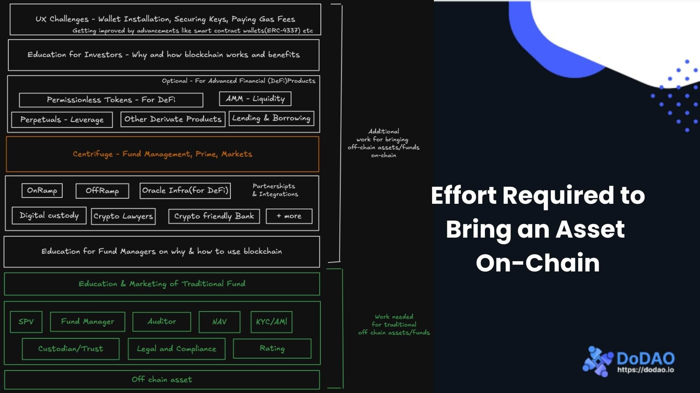
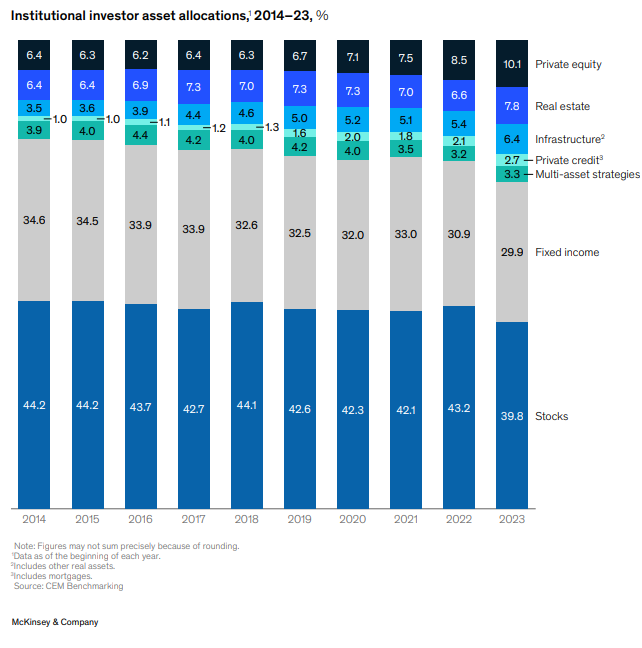
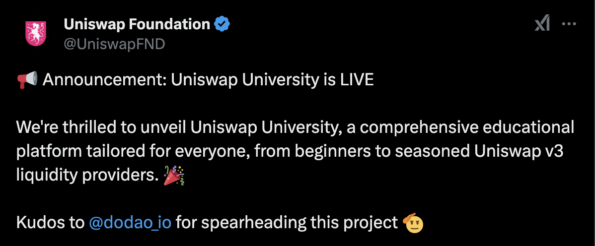
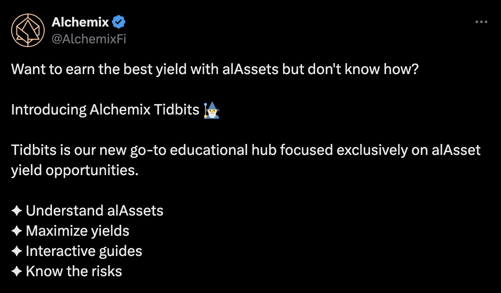
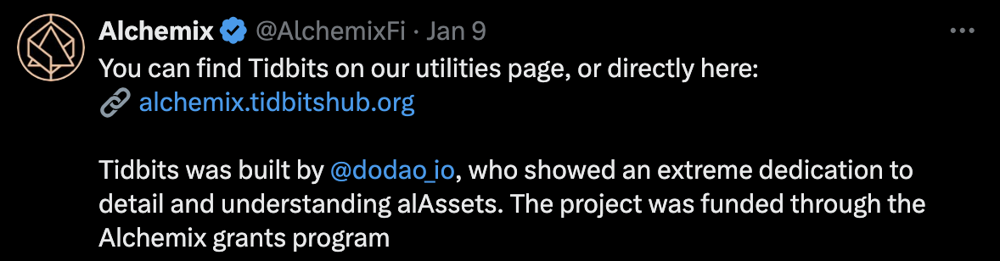
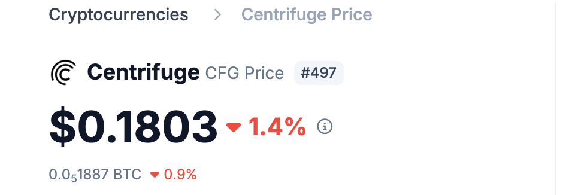

### Short Summary
The most reliable and sustainable way to increase the Total Value Locked (TVL) on Centrifuge and attract more investors is by offering high-quality, high-yielding funds and assets. To achieve this, we need a greater inflow of on-chain funds, which, in turn, requires onboarding more fund managers. Simplifying the onboarding process for fund managers is essential to this goal, and DoDAO plans to address this through education.

Currently, establishing a Real-World Asset (RWA) on-chain fund on Centrifuge is significantly more challenging than on Web-2 platforms, such as Percent.com, Fundrise, and RealtyMogul.  

Our objective is to streamline the onboarding process on Centrifuge by developing comprehensive educational content for fund managers. This content will cover:  

- What on-chain funds are and their benefits for fund and asset managers  
- Steps to launching an on-chain fund  
- Necessary partnerships needed for success  
- Types of products and assets to target

Additionally, we will create educational content for investors to help them understand:  

- Basic terminologies and structures of alternative investments  
- Yield and risk considerations 
- Key factors to differentiate between funds

### High level objective

RWA is one of the most relevant but challenging areas of blockchain. Managing an RWA project currently requires more effort than a DeFi project or a traditional fund. Fund managers exploring on-chain funds have to spend days learning the benefits of blockchain, months finding suitable partners, and additional months explaining the technology to investors. Investors also face challenges, including understanding asset custody and safeguarding private keys, etc. This effort is duplicated by every fund manager, with no onboarding documents or blueprints available for their help.

To grow the space, we must first onboard high-quality fund managers by educating them and helping them form essential partnerships for running on-chain funds. Simultaneously, significant effort is needed to educate investors. They must understand where their money is invested, how yields are generated, and how to differentiate between good and bad funds.

DoDAO will support Centrifuge in addressing these challenges by creating detailed educational content in various formats, engaging in business development by connecting with traditional fund managers and introducing them to on-chain funds and Centrifuge, assisting in onboarding interested fund managers, and helping them establish critical partnerships for successful on-chain fund operations. 

At DoDAO, we have extensive knowledge in this field and we share our insights at [https://chainedassets.com](https://chainedassets.com). We are also developing an AI agent to generate reports summarizing key details of funds and opportunities, helping investors make informed decisions.

### Background of Proposal
The tokenization of Real-World Assets (RWA) remains one of the most significant use cases of blockchain technology. However, it has yet to achieve widespread adoption. Meanwhile, newer fields like decentralized finance (DeFi) and NFTs, which emerged only a few years ago, have rapidly gained market share and continue to grow.

**Current Situation**
The primary reason for the slow adoption of RWAs is the high level of effort required to bring funds and assets on-chain, which is significantly greater compared to traditional funds. Additionally, when comparing RWAs to newer investment crowdfunding platforms, we see that these platforms offer superior products and have successfully attracted a large number of investors.

For instance, Percent.com, a private credit platform, currently offers an average coupon rate of 18.13%, with a historical average of 14.22%.

In contrast, DeFi platforms such as AAVE, Compound, Morpho, and Spark typically offer 6-10% APY on stablecoins invested in trusted lending and borrowing protocols. While DeFi(when investing stables in trusted projects) may offer lower returns, it provides a superior user experience through instant liquidity and permissionless technology, allowing for more structured products to be built on top of it and eliminating friction for both lenders and borrowers.

Centrifuge bridges the gap between Web2 and DeFi, offering value to both types of investors—those who prioritize liquidity and those who seek long-term high returns. 

**Market and Growth Opportunity**
Due to high valuations, public equities have become less attractive, leading both individuals and institutions to shift toward alternative investments. 

Alternative investments share has been growing in recent years, which translates into more funds and assets, higher-quality investment products, and increased options for investors.

At present, setting up an on-chain fund requires significantly more effort and cost compared to a traditional fund. While the concept of tokenization is relatively easy to grasp, launching an on-chain fund involves additional complexities, including:
* Understanding the full process of creating and launching a token
* Key considerations when using a token contract
* Managing custody of digital assets
* Integrating with on-ramp and off-ramp providers
* Navigating regulatory hurdles and identifying preferred jurisdictions
* Educating investors about on-chain funds

While education alone is not a silver bullet that will solve all these challenges, it serves as a strong foundation upon which other initiatives—such as podcasts, meetups, and business development efforts—can be built.

### Description of Activity

The main goal of DoDAO is to help increase the number of funds on Centrifuge and make it the default platform for RWA (Real-World Asset) investments. Our work will focus on two key areas:

**1. Educating and Onboarding Fund Managers**
Currently, there is no single guide or documentation for fund managers to learn about:
* The benefits of blockchain technology compared to traditional systems
* The full process of creating an on-chain fund
* Considerations while launching a token
* DeFi intergrations
* Global crypto regulations to help them pick the best jurisdiction for their fund
* Options for KYC/AML, token structuring, custody of assets, and more
* Features of Centrifuge

To address this, we will create educational materials, including:
1. **Tidbits Hub**: A resource like the one we built for Alchemix - [https://alchemix.tidbitshub.org/](https://alchemix.tidbitshub.org/) 
2. **Detailed Documentation**: A comprehensive docs site with detailed information on the above mentioned topics
3. **Presentation** A detailed presentation that can be used by anyone to educate fund managers on the benefits of on-chain funds and the process of creating them.

**2. Educating Investors**

During the market downturn of 2022–2023, many RWA projects offering under-collateralized loans failed. A key issue was that users didn’t understand where their funds were invested or the risks involved.

Alternative investments (private investments) are often riskier but promise higher returns. Retail investors may not fully understand these risks, leading them to choose poor projects. To make Centrifuge the most trusted platform for RWA investments, we need to invest in user education.

We will create materials such as:
* Tidbits Hub: Similar to the one built for Alchemix - [https://alchemix.tidbitshub.org/](https://alchemix.tidbitshub.org/) 
* Presentation: A presentation that can be used by anyone to educate investors.

### Goals and Themes 

**Goals**
This proposal focuses on creating educational materials to help fund managers easily transition their funds on-chain and use Centrifuge.

**Themes**
1. **Grow Adoption**: \
By simplifying the process for fund managers to bring their funds on-chain, we aim to directly increase the adoption of Centrifuge.
2. **Awareness, Education, and Community**: \
Our strategy to raise awareness is through education and community-building. We will create extensive content that can be reused by anyone in the Centrifuge community.

### Risk Assessment
At this time, we do not see any significant risks associated with this engagement. DoDAO has previously created educational content for leading blockchain projects and has conducted extensive research on RWAs, which is published here: [https://research.chainedassets.com/](https://research.chainedassets.com/).  

However, timely and regular touchpoints for reviews and feedback on our work will be highly beneficial.

### Sustainability

* **How the project will be sustained after completion:**
The project will create educational materials and onboarding processes that can be reused by fund managers and investors. These resources will remain accessible, allowing continuous onboarding even after the initial project concludes.
* **Will additional funding be needed in the future?**
We will maintain and update the educational materials for the next six months, and no additional funding will be required for minor updates. However, for major overhauls—such as updating content significantly or creating new educational materials—additional funding may be necessary.

### Collaborations and Partnerships

* **Will the project involve cooperation with other groups or DAOs?**
The final milestone will involve ensuring that the content is tailored to Centrifuge and aligns with its priorities. To achieve this, it would be beneficial to receive detailed feedback from a few members. If accepted, we plan to share our updates regularly on forums.

### Change or Improvement

* What is the change or improvement that this mandate will bring?
Its an improvement. This project will simplify and standardize the process of creating on-chain funds, making it easier for fund managers to adopt Centrifuge. It will also improve investor understanding of risks and opportunities, building trust in Centrifuge as the go-to platform for RWA investments.

### Alignment to the Mission of Centrifuge DAO

* **Why this is important and aligned with the mission:**
Centrifuge aims to bridge the gap between traditional finance and blockchain. This project directly supports that mission by educating fund managers and investors, encouraging the adoption of on-chain funds, and fostering trust in the Centrifuge platform.
* **How will this project affect the DAO community?**
The project will strengthen the Centrifuge ecosystem by bringing more high-quality funds and engaged investors, ultimately increasing usage and adoption of Centrifuge products.

### **Description of Individual/Group Seeking Funding**
# Team:
DoDAO Team - https://dodao.io

DoDAO has been working on many tooling and educational initiatives in the blockchain space. We have been working with some of the top projects in the space and have been contributing to the ecosystem in various ways. We have been working on

**Governance Tooling Initiatives**
- Onchain Governance Proposal Analyzer for Compound (Done)
- Command Line Interface code generation POC for Compound's Governance (Done)
- Asset Analysis Dashboards (Done) - https://www.comp.xyz/t/asset-analysis-dashboard/5643
- Uniswap's V4 Technical Documentation (Done)
- Alternate Governance - Market Updates - (Done) 
- https://www.comp.xyz/t/market-updates-alternate-governance-track/5379

**Educational Initiatives**
- https://uniswap.university
- https://arbitrum.education
- https://compound.education
- https://optimism.university
- https://alchemix.tidbitshub.org
- https://safe-global.tidbitshub.org - In Progress

**References:** 
Uniswap
https://cointelegraph.com/news/uniswap-launches-educational-platform-do-dao
https://uniswapfoundation.mirror.xyz/gikWizjfZvgDH1lqwXaCEF2bdT6G4Rv6xm9B1u61Dr0

**Alchemix**

**RWA Work**
DoDAO has published extensive foundational content on real-world assets at [Chained Assets](https://chainedassets.com). This initiative, is a work in progress, and was started a few months ago, serves as a public good aimed at expanding knowledge, improving verifiability, and enhancing the safety of investments. It strives to make the blockchain ecosystem more trustworthy and secure for all investors.

**DoDAO's Products**
- Tidbits Hub(Tidbits & Clickable-Demos/Simulations)
- Academy Site Builder
- AI Agent for Investment Analysis(In Progress) - V1 will target crowdfunding projects

### Budget
**Amount requested and how it is calculated:**
DoDAO will have one member working full-time on this task, primarily Robin Nagpal, who will be responsible for the creation and overall delivery of the project.

The estimated time, effort, and cost for this work are approximately:
*(4 months × 1 member × $80/hr) ≈ $56K.*

We have reduced the requested amount based on the feedback received on the proposal; however, the effort cannot be reduced as we do not want to compromise on quality.

**Total: $48,000**

**Wallet Address** - 4cDtAZEpWESaPeVaVJGiFdUXnj245hkjoz7jyzY868YHFHnQ

**CFG Requested** - 263,013

**Rate Used** - 0.1825 (Feb/18/2025)

**What happens in case of price volatility**: We are flexible and will defer to the DAO/TAG team’s judgment on what is reasonable. In past projects, we have typically received payments either in stablecoins or in the requested token amount based on a specific day's rate, which means we have always delivered everything requested, regardless of whether the price rose or fell.

### **Delivery and Reporting**  

To ensure transparency and progress tracking, we will break the project into four key milestones, each focusing on a specific aspect of educational content and onboarding.  

1. **Milestone 1: Research and Study (6 weeks)**  
   We will research the challenges fund managers and investors face when adopting on-chain funds. This includes analyzing existing RWA platforms, Private Credit and Real Estate public/crowd-funding platforms, identifying best practices, and understanding global regulations. We will also assess investor knowledge gaps and risk concerns to shape the educational content effectively.  

2. **Milestone 2: Tidbits & Documentation Site for Fund Managers (6 weeks)**  
   Based on our research, we will create a **Tidbits Hub** for fund managers, offering a step-by-step guide to setting up an on-chain fund on Centrifuge. A **comprehensive documentation site** will also be developed, covering key topics such as tokenization, custody, KYC/AML, and regulatory considerations. The goal is to make the content **clear, interactive, and actionable** for fund managers.  

3. **Milestone 3: Tidbits Site for Investors (2-3 weeks)**  
   A separate **Tidbits Hub for investors** will focus on educating them about alternative investments, risks, and rewards of on-chain funds. The content will simplify complex financial concepts, covering **how on-chain funds work, understanding yields and risks, and differentiating between funds**, ensuring accessibility for both retail and institutional investors.  

4. **Milestone 4: Presentations and Centrifuge-Specific Updates (2 weeks)**  
   We will develop **detailed presentations** to educate fund managers and investors, designed for easy sharing across Centrifuge’s community, partners, and business development teams. Additionally, we will incorporate **Centrifuge-specific updates** to ensure all materials align with the platform’s latest developments and roadmap.  

### Reporting and Feedback  
After each milestone, we will **share updates on the forums**, highlighting progress and key learnings. For the **final milestone**, we welcome detailed feedback from Centrifuge members to refine the materials, ensuring they effectively serve fund managers and investors while aligning with Centrifuge’s long-term vision.

Link to the RFC on the Forum: https://gov.centrifuge.io/t/cp138-centrifuge-education-only-parallel-track-by-dodao/6707/1

Link to the onchain vote (council motion + referendum): https://centrifuge.subsquare.io/council/motions/110