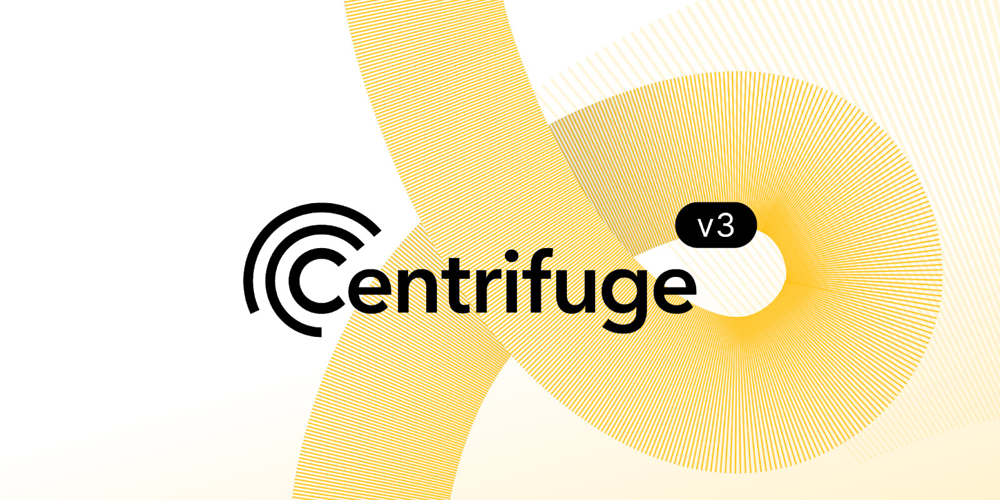

---
cp: 141
title: Initiate the development of Centrifuge V3, a multi-chain, EVM based protocol
authors: @jeroen
contributors : @martin @mustermeiszer @0xgraham
uses-component: CP4
technical-proposal: no
requires-onchain: no
impacts/modifies:
status: rfc
date-proposed: 2025-02-03
date-ended:
---

## Short Summary

This proposal seeks governance approval to initiate the development of Centrifuge V3, an EVM-based protocol, to drive the next phase of growth for the RWA market. Built as a multi-chain system, this next-generation protocol will introduce features such as chain abstraction, modularity for diverse assets and investors, and enhanced composability with DeFi. The protocol will also migrate governance and CFG token support to an EVM chain, aligning with the ecosystem where the majority of Centrifuge’s activity already resides. This initiative positions Centrifuge to lead the rapidly growing RWA space and meet the evolving needs of institutions and DeFi participants.

## High level objective

By building on EVM, Centrifuge ensures access to the largest pool of onchain liquidity, unmatched developer tools, and robust ecosystem support, positioning itself as the go-to solution for institutions.

The proposal to prioritize building natively on the EVM stems from several critical considerations:

* Total Value Locked (TVL): More than 95% of the total value locked in Centrifuge Liquidity Pools originates from EVM chains. Furthermore, most investors currently hold their pool tokens on EVM chains, making it the logical platform to expand our reach and impact.
* DeFi Composability: DeFi composability is one of the key drivers for building on the EVM. By leveraging EVM standards, Centrifuge can seamlessly integrate with a wide array of DeFi protocols.
* Developer Tooling: The EVM ecosystem offers mature and widely adopted tools, making it easier for developers to build, deploy, maintain, and integrate applications. This also facilitates seamless integration for partners and external integrators.
* Onchain Liquidity: EVM-compatible blockchains host a significantly larger pool of available onchain liquidity compared to other ecosystems. Additionally, EVM chains offer robust native stablecoin support.
* Ecosystem Support: EVM protocols enjoy broad support from exchanges, partners, and other infrastructure providers.
* Institutional Support: Banks, Asset Managers, Funds all want to build on EVM chains, and these are Centrifuge’s main target audience. The EVM protocol will be best positioned to support them.

Centrifuge’s approach is purpose-built for RWAs, including systems in place for regulatory compliance, risk mitigation and seamless integration with traditional finance infrastructure. The new protocol will enable modular, interoperable ecosystems for tokenization, asset management and distribution, creating a streamlined experience for institutional users while leveraging the EVM’s unparalleled network effects.

## Background

Since founding in 2017, Centrifuge has been a pioneer in RWAs, setting the standards and benchmark for innovation and institutional sophistication. As the market has evolved, so has Centrifuge - from minting the first RWA with MakerDAO, to creating the first RWA market with Aave and building the first onchain fund with BlockTower, the Centrifuge protocol has improved with every product, partnership and use case developed.

The next iteration of the protocol will take our learnings from the years, paired with customer and partner demand and the evolving industry landscape to build the best ecosystem for RWA tokenization and fund management.

Centrifuge’s evolution has been driven by a deep understanding of the ecosystem and a commitment to addressing the growing needs of bringing RWAs onchain. However, the explosive growth of the RWA space requires a next-generation protocol to stay ahead.

Centrifuge V3 is not just an upgrade—it’s a necessity. As the RWA market scales into the trillions, Centrifuge must position itself to meet the demands of a more complex and interconnected ecosystem. Building on the EVM ensures:

* Seamless integration with the dominant blockchain infrastructure.
* Access to the largest liquidity pools and developer ecosystems.
* The ability to capture new opportunities and partnerships as RWAs become a cornerstone of DeFi.

This protocol will be the foundation for the next growth cycle of RWAs onchain, enabling Centrifuge to maintain its leadership and unlock new possibilities for institutional adoption and ecosystem growth.

## Description of Activity

The proposal seeks the approval of the community to build Centrifuge V3 by k/factory.

k/factory is a software studio founded by the original contributors to the Centrifuge protocol.

Along with the other developers, k/factory provides core development and infrastructure to the Centrifuge Protocol since the early days.

k/factory will provide continuous updates and progress to the DAO through the development cycle.

### Vision for the new Centrifuge V3

Centrifuge V3 aims to function as a fully multi-chain system with the following capabilities:

* Accept investments and manage pools from any chain.
* Allow asset managers to manage their pools from their preferred chain.
* Implement chain abstraction to ensure flexibility and efficiency.
* Utilize a secure, multi-bridge approach to enhance security and interoperability.
* Enable external developers to build on top of the protocol.

### Enhanced Standards and Flexibility

* Adoption of key standards such as ERC7540, ERC6909, and additional asset-side standards.
* Support for flexible fund structures, enabling third-party development and innovation.

### Synchronous and Asynchronous Composability

* Settlement Side: Synchronous composability for seamless transactions.
* Accounting Side: Asynchronous composability for efficient management.
* Investment Side: Asynchronous composability with optional synchronous features for flexible investments.

### Protocol-Level Enhancements

* Multi-chain asset management: Expand asset-side and pool management capabilities to be multi-chain.
* Synchronous composable asset integrations: Enable seamless integration with new tokenized assets on any EVM-compatible chain.
* Asset issuance flexibility: Facilitate integrations with externally developed tokenized assets, enhancing scalability and ecosystem growth.
* Pool management flexibility: Issuers can choose their preferred chain for pool management, improving accessibility and efficiency.

### Token

Centrifuge V3 would be supported with a new native CFG token, aligning governance with the ecosystem where the majority of Centrifuge’s activity and users already reside. This move would simplify governance participation by leveraging EVM’s established infrastructure, such as wallet compatibility and governance tools, while increasing visibility and accessibility for a wider audience. If this proposal is approved, a separate proposal will follow in the coming weeks to detail the technicalities of the new token and its migration process.

## Alignment to the mission of Centrifuge DAO

The development of the Centrifuge V3 aligns with Centrifuge's mission to create a decentralized financial ecosystem and unlock liquidity for real-world assets. This initiative ensures that Centrifuge stays at the forefront of innovation, broadens its reach and utility, and maintains its position as a leader in today's RWA ecosystem.

Link to the RFC on the Forum:  https://gov.centrifuge.io/t/cp141-initiate-the-development-of-centrifuge-v3-a-multi-chain-evm-based-protocol/6734

Link to the off-chain vote:  