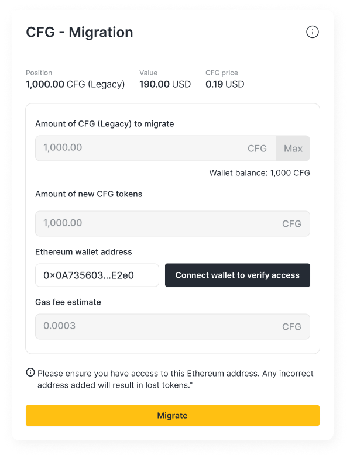
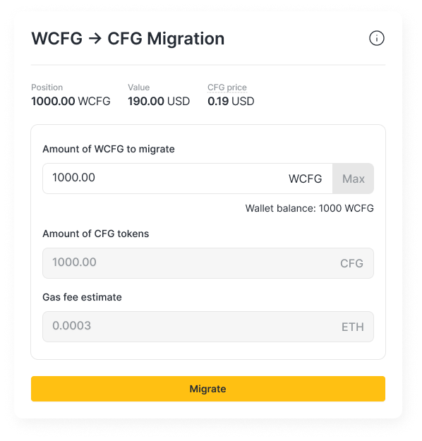

## Short Summary
This proposal seeks governance approval for migrating the Centrifuge governance token (CFG) to an EVM-compatible token standard. It builds upon CP 141, which introduced Centrifuge V3, a multi-chain, EVM-based protocol.

To align governance with Centrifuge V3, this proposal mandates k/factory to launch a new EVM CFG token and initiate the structured migration of existing CFG and WCFG tokens.

The current Centrifuge Chain CFG token will be deprecated along with WCFG and replaced by a new EVM-based CFG token, minimizing disruption for token holders through a transparent migration plan.

## High-level objective
The transition to an EVM-based CFG token is designed to:

Improve Governance: Enable direct onchain governance via established EVM tools such as Snapshot, Tally, and others.

Enhance Composability: Broaden exchange and DeFi integration for improved market efficiency.

Streamline Liquidity: Consolidate liquidity under a single, native EVM-based CFG token.

The goal will be to achieve these benefits while ensuring a seamless migration process that minimizes costs and maximizes value for existing token holders.

## Background: Alignment with CP 141 & Centrifuge V3

Centrifuge has pioneered Real-World Asset tokenization, leading the institutional adoption of onchain markets. The proposal of Centrifuge V3 ([CP 141](https://github.com/centrifuge/cps/blob/main/cps/CP141/CP141.md)) represents an important step towards a multi-chain, EVM-based protocol, offering enhanced liquidity, interoperability and institutional adoption.

Currently, the governance token, CFG, is split across:
* CFG on Centrifuge Chain (legacy token)
* Wrapped CFG (WCFG) on Ethereum

With the deprecation of the Centrifuge Chain, migrating CFG to an EVM-compatible token is necessary to ensure governance continuity and liquidity consolidation within the EVM ecosystem.

Migrating WCFG to CFG will reduce confusion on token structure, deepen liquidity and enable the ability to add native governance rules to the new CFG token.

## Description of Activity

This proposal outlines the development and deployment of a new EVM-based CFG token and a transparent migration process for existing CFG holders. The key aspects include:

### Token Specification and Tokenomics

* Token Swap Ratio: 1:1
* Current Total Supply: 560,246,258 CFG
  * CFG Supply on Centrifuge Chain: 414,100,347 CFG
  * Wrapped CFG Supply: 146,145,911 wCFG
* Proposed Total Supply: 675,000,000 CFG

The proposed 115M CFG will be minted to the Centrifuge Network Foundation and used for the following:

* Support the migration of the CFG token with exchanges and market makers
* Incentives for targeted and relevant DeFi users to participate in value aligned activities
* Strategic initiatives that support the growth of the protocol and product stickiness

The newly minted tokens will be gradually released over an extended period, guided by a structured distribution schedule designed to promote sustainable growth, align stakeholder incentives, and drive long-term value for the Centrifuge protocol.

The current 3% yearly inflation will remain in place and accrue to the Centrifuge DAO treasury.

### Migration Plan and Process

Migration Start Date: [TBD]

Token Swap Ratio: 1:1

All CFG and WCFG token holders will be able to migrate their tokens by following the instructions on the Centrifuge App (https://app.centrifuge.io).

#### Legacy CFG

1. Users will provide an EVM-based address.
2. Users will submit a transaction on the Centrifuge Chain to request migration.
3. Upon completion, users receive new CFG in their EVM wallet.

#### WFCG (Wrapped CFG on Ethereum)

1. Users will submit a transaction on Ethereum to swap WCFG for CFG.
2. The process will follow standard token swap mechanisms, ensuring minimal friction.

#### Additional Migration Details

* Migration Window:
  * Open: TBA. If the following proposal is successful, a post will be made on this post informing the community when the migration window opens.
  * Close: Nov 30th, 2025 to ensure all users can transition.
* Unclaimed Tokens: After the migration window closes, all unclaimed legacy CFG will be migrated to the CFG treasury.
* Centrifuge Treasury: The Centrifuge DAO Treasury (with all assets) will be migrated from the legacy chain to an EVM chain.
* Please note, if you have any legacy CFG locked in onchain governance on Centrifuge Chain, you will need to unlock them first before migrating. If you have used conviction voting, this could take up to 36 weeks, depending on the conviction multiplier.

### Governance & Future Enhancements

#### Phase 1: Governance via Snapshot
* Initial governance voting will be conducted offchain via Snapshot to ensure a smooth transition.

#### Phase 2: Onchain Governance Framework
* A subsequent proposal will introduce an onchain governance mechanism leveraging smart contract voting.
* The governance structure will maintain flexibility for upgrades.
* Key parameters such as quorum, voting power distribution, and governance execution mechanisms will be determined in a follow-up governance proposal.

## Alignment to the mission of Centrifuge DAO

With the deprecation of Centrifuge Chain, migrating CFG to an EVM-based token is a necessary step to ensure the continued evolution of governance, liquidity, and protocol operations. This transition aligns with Centrifuge’s mission by maintaining accessibility, enhancing efficiency, and securing the long-term sustainability of RWAs onchain.

—-------------------------------------------------------------------------------------------------------------

The RFC will be open for a minimum of 7 days.

Looking forward to any feedback and any concerns you might have with this proposal.

—-------------------------------------------------------------------------------------------------------------

### Next steps
If there is support for this proposal, the next steps will be to submit it to the Proposal Repository on GitHub and create an Opensquare snapshot vote.