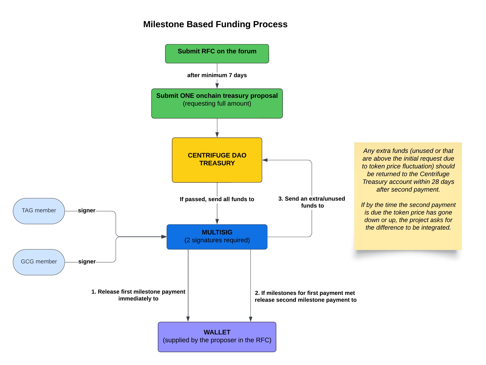

# CP2 (Request for Funding)

Any entity (group or individual) who seeks funding from the Treasury, would need to create a proposal, using the CP2 component. There can be different scenarios for an entity applying for funding:

- The entity already created a proposal using both the CP1 and CP2 component (that passed), 
received funding and wants to re-apply
- The entity already created a proposal using the CP1 component (that passed) and wants to apply for funding
- The entity doesn’t have a mandate but wants to apply for funding for a one time service

The Treasury is administered by the Council so only the Council will vote on the proposal - token holders will not vote on it.

It is possible to make a Treasury proposal on behalf of someone else.

A Treasury proposal can only be made if there are adequate funds in it to cover the funding request.

When creating a request for funding, make sure to provide the calculations for the requested amount and how they will be distributed. You can see an example of how it can be done in [this post](https://gov.centrifuge.io/t/cp117-give-a-mandate-to-form-the-treasury-advisory-group/6464).

**If the request is above equivalent of $50,000, the milestone based funding process below will be followed.**



## GOVERNANCE PROCESS

|STEP|DESCRIPTION|DURATION|
| --- | --- | :---: |
|1|Submit proposal to the [Centrifuge Proposals Repository](https://github.com/centrifuge/cps) (on Github) to get a pull request #|-|
|2|Create an RFC on the [Forum](https://gov.centrifuge.io/c/cfg-governance/chain-governance/18) (see template below for title, tags and content)|Minimum 7 days|
|3|Create an on-chain [Treasury proposal](https://polkadot.js.org/apps/?rpc=wss%3A%2F%2Ffullnode.parachain.centrifuge.io#/treasury)|-|

## TEMPLATE
```
Title: CPXXX: [TITLE OF PROPOSAL]

Tags: cp2, rfc
```
### Body of the RFC must contain:
```
cp: [XXX]
title:
authors: [forum handles]
contributors: [forum handles]
beneficiary: [name]
wallet: [wallet address]
uses-component: [cp1|cp2|cp3|cp4|cp5|cp32|cp63]
technical-proposal: [yes|no]
requires-onchain: [yes|no]
impacts/modifies:
status: [rfc|voting|passed|rejected]
date-proposed: [YYYY-MM-DD]
date-ended: [YYYY-MM-DD]

Short Summary
- One sentence summary describing the project for which funding is sought

High level objective
- A short description of the objective that this proposal will achieve

Background of Proposal
- What are the historical and contextual factors that make this proposal relevant and aligned with the mission?

Description of Activity
- Provide a detailed description of the activity that will be undertaken

Goals and Themes 
- Which goal(s) does this proposal help achieve? 
- What theme(s) does this proposal support?


Risk Assessment
- Describe the potential risks of the project?
- How do you plan to manage these risks?

Sustainability
- Describe how the project will be sustained after completion?
- Will additional funding be needed in the future?

Collaborations and Partnerships
- Will the project involve cooperation with other groups or DAOs?

Change or improvement
- What is the change or improvement that this mandate will bring?

Alignment to the mission of Centrifuge DAO
- Explain why this is important and aligned with the mission
- How will this project affect the DAO community?

Description of Individual/Group seeking funding
- Detail the roles and responsibilities of each member
- Provide backgrounds of each of the member(s) of the group seeking funding
- Supply DIDs of each member
- Supply evidence of work via social media links for each member

Budget
- Describe in detail the amount requested and how is it calculated
- How are the funds distributed within the group?

Measurement and Evaluation
- How will you measure the success of the project?
- List the key performance indicators (KPIs).

Delivery and Reporting
- Show a timeline of when the objective(s) will be delivered and how this will be reported

Legal and Ethical Considerations
- Does the project have any legal or ethical issues?
- How will you address them?
```

You can find more information about **Goals and Themes** in CP130 [here](https://github.com/centrifuge/cps/blob/main/cps/CP130.md#goal-and-themes).

**Important:** remember to update the Forum post (tags, link to vote and outcome of the proposal) as the proposal progresses through the stages.