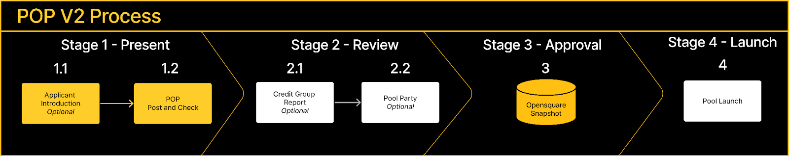

## Short Summary
Proposal for an improved version of the POP from the [current POP that exists today](https://gov.centrifuge.io/t/introducing-the-pool-onboarding-proposal-pop/3846).

## High Level Objective
To simplify the POP process for RWAs onboarding through the Centrifuge protocol and to increase the Community engagement and participation in the process. If this proposal is to pass in the future, it will be added as CP5 (POP) to the governance process.

## Background
The POP has been active for over 6 months. In that time, we’ve seen 12 POPs submitted, a number of Introductions, a couple of Pool Parties, and the discussion and engagement around RWAs continues to rise across the Forum.

A [POP Workshop back in October](https://gov.centrifuge.io/t/the-pop-workshop-what-s-next-for-the-pool-onboarding-proposal/4665) revealed opportunities for improvement, with insights coming from both the Community and POPs directly.

## Why the POP exists
Let’s quickly revisit why the POP exists.

The POP is a community owned and CFG governance-led process for onboarding RWAs into DeFi through the Centrifuge protocol.

The POP is intended to both simplify the process, as well as curate the quality of RWAs financed through Centrifuge in a transparent, open structure that enables participation from the community as well as from experts.

The process is held by the Community, and most specifically CFG token holders, using their tokens to vote on POPs.

## Detailed Description of Proposal
This proposal hopes to accomplish:

* A long-term vision to develop a decentralized onboarding process owned by the community through governance
* An immediate term way for easier access to the Pools and better investor engagement around high quality opportunities reviewed by the Credit Group
* A more clear outline of requirements and process to launch a Pool through Centrifuge

This version of the POP is simpler, provides on-chain voting to CFG token holders, and places the [Credit Group](https://gov.centrifuge.io/t/poll-formation-of-credit-group/3911) more prominently into the process, to report on each POP.

Please review the Process (image below) and use the accompanying **POP Process** appendix, which includes an explanation for each step above. There have also been adjustments to allow for more subjectivity and more description in the **POP Proposal Template**, while intending to be more helpful through the **POP Proposal Guidance**, which will be agreed upon by the Community to help provide guidance and direction to POPs before they submit a POP through governance.

### Appendices
* [POP Process](../CP5/Appendices/process.md)
* [POP Proposal Template](../CP5/Appendices/proposal-template.md)
* [POP Proposal Guidance](../CP5/Appendices/proposal-guidance.md)

## Alignment to the Mission of the Centrifuge DAO
This process attempts to decentralize the onboarding of RWAs and drive decisioning through governance and the Centrifuge Community.

Link to the RFC on the Forum: https://gov.centrifuge.io/t/rfc-pop-v2-pool-onboarding-process-version-2/4875
Link to the Opensquare Snapshot: https://voting.opensquare.io/space/centrifuge/proposal/QmVoxVW24CWuznqi45cyJby96sS4uFbJ9bDXNJvCX66AuU