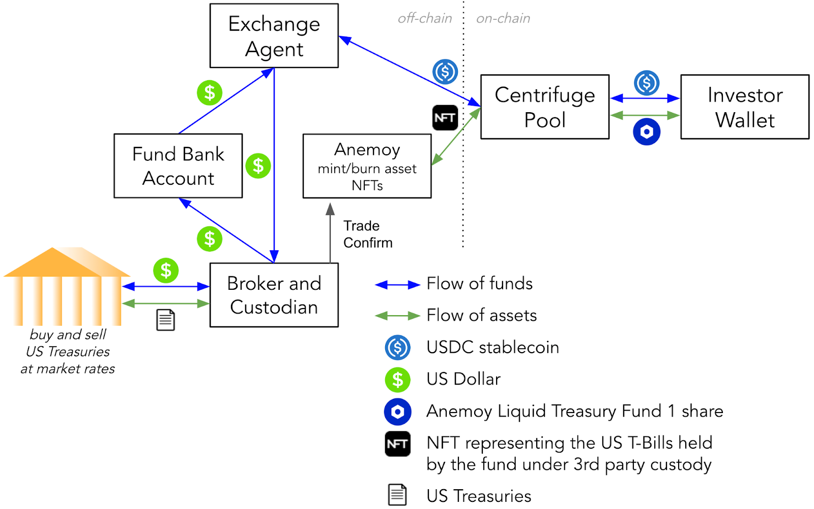

# Overview

* Business Name: Anemoy Liquid Treasury Fund 1 Limited
* Current AUM: n/a
* $ Volume of Transactions Completed Last 12 months: n/a
* Target Launch Date: Oct 3, 2023
* Location and Team Size: British Virgin Islands (“BVI”), 2
* Years in Operation:
  * Anemoy Limited (“Anemoy”, based on the [Anemoi](https://en.wikipedia.org/wiki/Anemoi), the Greek wind gods) is a de novo asset management company launching its inaugural product, the Anemoy Liquid Treasury Fund 1 (the “Fund”) through its British Virgin Islands wholly-owned subsidiary Anemoy (BVI) Management Ltd.
  * The Fund will be a regulated investment fund approved by the British Virgin Islands Financial Services Commission, for which the shares of the fund are issued in tokenized form under BVI law.
  * The directors and team members (“Team”) are finance, fintech, startup, and crypto veterans with a combined experience of 50+ years.
  * Martin Quensel ([Linkedin](https://www.linkedin.com/in/martinquensel/))
    * Serial entrepreneur; Co-founded Centrifuge; Startup before co-founding Centrifuge was the Fintech [Taulia](https://taulia.com/), which was revolutionizing Supply Chain Finance, finally acquired by SAP; Invented with the Centrifuge team the idea of “real-world assets” (or “RWA”) as the now fastest growing space in decentralized finance (“DeFi”)
    * Co-founder and CEO of Anemoy
    * Director of Anemoy (BVI) Management Ltd.
  * Jason Meads ([Linkedin](https://www.linkedin.com/in/jason-meads-1943aa/))
    * Private equity specialist who has worked closely with Patron Capital since 2002 and is now on the board of funds; Also director of Intriva Capital Management who are also highly active in the real estate private equity space in Europe; served on the board of Binance (Jersey) for 3 years; Runs the Special Situations desk at the Blue Marine Foundation; Further expertise includes blockchain, ocean protection and climate change
    * Director of Anemoy (BVI) Management Ltd.
* Historical Loan Tape (years): n/a
* Key Professional Partners (legal, accounting, operational, technical, structuring):
  * The Team is working with world class partners for the on- and off-chain parts of the structure and using state of the art crypto and cybersecurity tools to protect clients.
  * The Team has chosen to internalize many of the key business functional areas (i.e., legal, accounting, operational, technical and structuring).
  * Notwithstanding, [Celadon Financial](https://celadonfinancial.com/) will act as broker and custodian for the underlying assets, which represent various United States (“US”) government debt obligations (broadly referred to throughout this POP as “[US Treasuries](https://www.investopedia.com/terms/u/ustreasury.asp)” issued by the US treasury) with short maturity, high liquidity, and least impacted by [US interest rate](https://www.bloomberg.com/markets/rates-bonds/government-bonds/us) changes, which are [US Treasury Bills](https://www.investopedia.com/terms/t/treasurybill.asp) ("T-Bills").
  * Further, the services provided by Celadon Financial will be combined with an exchange agent for the stablecoin to fiat exchange and a banking service.
  * This POP does not require further off-chain service providers considering the focus on decentralized institutional investors like decentralized autonomous organizations (“DAOs”) and their treasuries (not to be confused with the product offering this POP covers) have the capability to self-custody tokens.
  * Anemoy will onboard additional off-chain service providers as subsequent investment strategies are pursued. This will include further payment service providers, brokers, trustees, custodians, agents but tailored to the specific characteristics of each future offering.

# Strategy

## Business

* Describe your business and go to market strategy.
  * What makes your approach unique within your industry?
    * Anemoy is a digitally-native asset management platform (“DAMP”) built to provide both DeFi and more traditional (i.e., “traditional finance,” or “TradFi”) investors access to superior risk-adjusted returns enabled by blockchain technology.
    * With respect to TradFi interest in blockchain-enabled investments, despite tokenized assets being forecasted to reach $4-16 trillion by 2030 (Citigroup (citi.com), BCG (bcg.com), BlackRock (blackrock.com)), these assets face a “circular dependency” between two factors – investor adoption and institutional-quality offerings. TradFi investors require reliable credit quality featuring market-standard structures benefitting from truly value-additive technology. Venture-backed business founders, on the other hand, could benefit from investor involvement in developing institutional-quality offerings.
    * Further, there are significant limitations in the types and quality of investment opportunities available to DeFi investors (i.e., namely DAOs). For example, a DAO treasury portfolio consisting of stablecoins, tokenized US Treasuries, tokenized private credit (i.e., what is most commonly appreciated as “RWA”), and cryptocurrencies (e.g., Bitcoin, Ethereum, etc.) – representing the general slate of options available to DeFi investors today – is a far cry from the risk-reward optionality offered to TradFi counterparts.
    * There is a clear market opportunity to bring institutional-quality investment processes on-chain, which Anemoy believes will be further enhanced by providing digital asset investors (both present and potential) necessary consultative services and general education. Anemoy makes DeFi, including the Centrifuge protocol, accessible for professional investors.
    * This POP represents an initial step towards this vision by pursuing the most secure, reliable, and liquid structure possible for investors – US Treasuries. We believe the Fund offering is offering a compelling alternative to comparable products in regard to compliance, investor protection, and accessibility.
    * In effect, Anemoy is providing access to on-chain US Treasuries by offering an institutional-quality off-chain product structure for the leading DeFi tokenization & transaction structuring platform (Centrifuge).
  * Why are you a good partner for Centrifuge?
    * Anemoy was founded to help investors navigate the intersection of blockchain technology and capital markets infrastructure – of which the Team believes the Centrifuge protocol offers a superior alternative of both. Anemoy’s approach is tailored to act as an issuer (“Issuer”) on Centrifuge and to boost the “total value locked” (or “TVL”) of the protocol by onboarding new investor and asset types, beyond the US Treasuries Fund product.
    * Anemoy will be an active Centrifuge DAO contributor in addition to becoming a protocol Issuer. By bringing institutional quality investor processes and assets to Centrifuge, the protocol stands to benefit from improvements in TVL, as well as asset quality, accessibility, usability, security, interoperability, and compliance – in turn solidifying Centrifuge as the leading DeFi capital markets infrastructure solution.
    * The Team believes in its duty to contribute alongside the pre-existing vibrant, skilled community of ecosystem participants for the longevity and relative success (vis-a-vis traditional corporate governance methods) of the Centrifuge DAO.
  * How do you differentiate yourself from competitors?
    * Legal framework
      * The proposed pool pertains to the Fund, representing a tokenized and fully regulated and registered fund in the British Virgin Islands subject to approval by the BVI Financial Services Commission.
      * The Fund is open to eligible non-US investors only (further specified in the forthcoming offering materials).
      * Investors need to pass know your customer (“KYC”) and anti-money laundering (“AML”) requirements of the BVI.
      * An exchange agent, bank, broker and custodian act as independent service providers making sure that the fund cannot repurpose funds or assets.

* Centrifuge
  * NFT and on-chain transparency support for single asset holdings
    * Investors purchase Fund shares by way of contributing capital (i.e., USDC) to the pool. The proceeds from the investment in the Fund shares are used to manage the US Treasuries portfolio. The US Treasuries portfolio is represented as (a) non-fungible token(s) (“NFT(s)”) which are used to calculate the net asset value (“NAV”) of the US Treasuries portfolio under management. The pool itself is issuing a single tranche of fungible tokens, which are Fund shares. Under BVI law, shares of companies can be issued in tokenized form.
  * Multichain support
    * AML/KYC-verified, Centrifuge-onboarded, non-US investors can purchase, sell, and hold Fund shares at any time on the layer-1 or layer-2 (“L1” and “L2,” respectively) of their choice as long as this L1 or L2 is supported by Centrifuge liquidity pools.
  * Centrifuge chain
    * Gives investors real-time visibility in the US Treasuries the Fund is holding with showing on-chain value and quantity of the NFTs in the Centrifuge pool of the Fund.

* How is your entity financed today, what are the current sources of capital:
  * Equity raised: n/a
  * Debt raised: n/a
* What is your entity’s revenue/fee model:
  * Origination fees: n/a
  * Target spread: n/a
  * Other: 15 bps management fee (see forthcoming offering materials for details)

## Capital

* Please explain the source(s) of, and ability to scale, your first-loss junior (TIN) capital in the pool:
  * Single tranche model without Junior and Senior tranches. The nature of the underlying asset - US Treasuries - does not require tranching or any further securitization. There will be one tranche for all the tokenized shares of the Anemoy Liquid Treasury Fund 1, which owns the underlying US Treasuries (T-Bills).
* Please explain the source(s) of, and ability to scale, your senior (DROP) capital in the pool:
  * See above
* Capital relationships and how much you will bring through Centrifuge KYC to invest in either senior or junior tranche of your pool:
  * Anemoy has a robust network of DeFi and TradFi capital providers. Additional information can be shared with interested parties in the sole discretion of Anemoy and bound by non-disclosure agreement (“NDA”).

## DeFi

* Outline why DeFi is important to your business strategy:
  * As mentioned above, an essential component of Anemoy’s broader strategy relies on providing superior risk-adjusted returns via DeFi. There is no Anemoy offering which is not tokenized and managed using DeFi at present, nor are any 100% off-chain products presently being contemplated by the Team
* Articulate why Centrifuge’s community and protocol is a fit for financing:
  * As mentioned above, Anemoy will use Centrifuge as the tokenization platform, which is an essential component for facilitating the Fund. It is anticipated that clients and partners of the Fund will be or are already part of the Centrifuge community.

# Structure: Risk & Terms

* Please explain the key risks inherent in this opportunity and asset class:
  * Asset performance
    * US Treasuries are amongst the most common short duration assets globally, the Team views this dynamic as closely resembling macro- or US creditworthiness- risk
  * Team risk
    * The Fund represents the inaugural offering from Anemoy. As such, there is risk in the Team’s ability to structure, execute and manage the Fund. The Team believes this risk is mitigated by (i) collective Team experience of over 50+ years across finance, fintech, startup, and crypto; (ii) managing a BVI-regulated Fund requires satisfying strict regulatory and compliance requirements; and (iii) the Team is engaged with credible service providers to support a high-quality investor experience.
  * Unit economics and scale risk
    * While representing a greater consideration for the Team than for potential investors, Anemoy’s ability to offer and maintain a US Treasuries product is contingent upon the Team’s ability to scale the offering to break-even profitability.
* Pool Size & Pipeline:
  * At Launch: $1+ million
  * 6 Months after Launch: $20 million
  * 12 Months after Launch: capped at $20 million and 20 investors
  * Origination Pipeline Details:
    * Strong pipeline, confidential but already work in progress
    * Rather sooner than 6 months
    * First product to be offered to DAOs and their treasuries
* Asset & Rates:
  * The POP relates to Anemoy providing investors an opportunity to access US Treasuries yield on-chain, such that several aspects of the Asset & Rates section are not applicable. However, to provide readers with like-for-like information, the Fund will use investor proceeds to purchase US Treasuries (T-Bills) in order to maintain certain portfolio attributes, which will be further specified in the forthcoming offering materials. As such, we expect investors to earn gross yields of comparable US Treasuries-related products, and net yields after giving effect to Anemoy fees, costs and expenses related to facilitating the product, which will be further specified in forthcoming offering materials. The Fund intends to offer investors daily subscription and redemption capability, with an expected redemption processing time of two (2) banking days but not more than seven (7) banking days. Lastly, given the underlying assets are US Treasuries issued by the US government, the credit risk associated with the asset is covered and published by [mainstream rating agencies](https://tradingeconomics.com/united-states/rating).
  * Asset Type(s): n/a
  * Average Ticket Size: n/a
  * Average Asset Maturity: n/a
  * Expect Default Rate: n/a
  * Expected borrowing rate on senior tranche (on-chain): n/a
  * Expected lending rate to end borrower (off-chain): n/a

Link to the RFC (POP) on the Forum: https://gov.centrifuge.io/t/pop-anemoy-liquid-treasury-fund-1/5651

Link to the onchain vote (council motion + referendum): https://centrifuge.subsquare.io/council/motions/74
