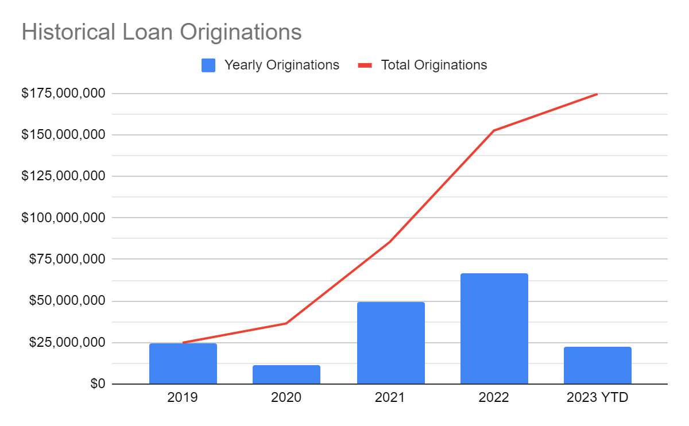

# Section 1: Partnership

**Value Proposition/Investment Thesis:**

New Silver NS2 was one of the first and longest-running pools on Tinlake, having securitized over 50mm DAI on-chain. New Silver is looking forward to the continued partnership with the Centrifuge community. NS Pool 3 will offer prospective investors the opportunity to gain on-chain exposure to real estate backed loans originated directly by New Silver Lending LLC. The Centrifuge App will allow New Silver to efficiently lower its cost of capital and provide enhanced returns compared to similar off-chain investments. 

**Company Info:**
New Silver Lending LLC
Location and Team Size:
Corporate Offices: 2475 Albany Ave, Suite 203-B, West Hartford, CT USA
Total Employees: 18

**Founding Team, Experience, and History:**

Kirill Bensonoff - Co-founder and CEO. Kirill is a technologist and a serial entrepreneur, having built and sold successful companies in the enterprise IT space prior to New Silver. Kirill is responsible for overseeing the business direction and technology development.

Alex Shvayetsky - Co-founder and Chief Risk Officer. Alex’s career spans over 25 years in commercial real estate management and operations. Alex is responsible for overseeing risk and lending practices.

Alexey Shevchenko - CTO. Alexey holds a master’s degree in computer science and has been building software for over a decade. Alexey oversees the company's software engineering efforts.

Landon Mizuguchi – CFO. Landon advises the team on planning, analysis, and related matters. Landon’s career has encompassed experience with firms such as PayPal (Strategic Finance), Goldman Sachs (Investment Banking) & EY (Transaction Advisory).

James Keegan - Loan Advisor Team Lead. James is an experienced banker, having previously been a commercial lender at DR Bank and at People’s United Bank. James oversees the loan advisory team.

John Coury - Head of Capital Markets. John has 15+ years of experience in real estate capital markets, having spent his career in private equity houses such as Axiom Capital. John is responsible for helping the company raise capital.

**Lifetime Originations:**

**AUM as of July, 2023:**

$53mm

**What does your company do?**

New Silver is a non-bank, direct lender primarily focused on providing short-term business purpose loans collateralized by residential real estate in the United States with an emphasis on the “fix and flip” sector. Fix and flip loans allow real estate investors to finance both the purchase and the renovation, or in some cases, refinance an existing investment property with sufficient equity from the borrower.

**What makes your approach unique within your industry?**

New Silver has developed proprietary loan origination and automated underwriting software that enables fast, API-driven loan decisioning and pricing. Through our innovative online platform, borrowers can apply for a loan online and instantly download a proof of funds letter and conditional term sheet. This is highly unique in the lending industry and allows for a user-friendly experience for the borrower.

**How do you differentiate yourself from competitors?**

1. Speed of Execution - Our online technology platform allows for near-instant, streamlined application and approval process for borrowers. In addition, borrowers can manage their loan lifecycle through an online portal and request construction draw reimbursements on a frequent basis.

2. Convenience - Get everything in one place, online. New Silver allows borrowers to apply, get approved, download term sheets, buy insurance and more all within minutes. Post-close management is also simple.

3. Loan Pricing - because of our technology, we need less manpower to scale, and can pass on those cost savings to clients.

**Company Financing:**

Equity raised:

None except founder's contributions

Debt funding:

New Silver Lending LLC does not utilize debt funding at the operating company level. The company manages its own balance sheet to fund all loans, and afterwards, loans are sold to “permanent” warehousing.

**Revenue model:**

1. Origination Fees. New Silver’s main source of revenue is generated through origination fees that are paid by the borrower at closing. This ranges from 2-3% of the loan amount.

2. Yield Spread. New Silver may retain interest in the loan through a yield spread, which for NS3 is projected to be at 1%. This is calculated on the spread between the weighted average cost of capital and the lending rate on the loan.

3. Fees. New Silver may charge various closing fees to the borrower, which range between $750 and $2000 per loan.

**Professional Partners:**
Loan Servicer: FCI Servicing, Inc.
Asset Manager: New Silver Lending, LLC
Accounting: Why Blue, LLC
Legal: Polsinelli, PC

## Section 2: Credit Experience

**Capital Markets:**
New Silver maintains extensive relationships globally with family offices, high net worth individuals, alternative investment firms and hedge funds. Many of our relationships are familiar with NS Pool 2 and our credit facility with Maker. Now that the legal structure and investor economics have improved, we believe there is increased appetite for on-chain investing in NS Pool 3. 

**Originations**
From July 2021 through June 2023, New Silver originated 360 loans with an aggregate loan volume of $120mm. New Silver consistently originates around $5-8mm per month. 

$ Volume of Transactions Completed Last 12 months:

$49,500,575

$ Volume of Origination Pipeline YTD:

$500mm+

**Historical Loan Tape (years):**

2019 - $24,835,032
2020 - $11,617,282
2021 - $49,232,870
2022 - $66,851,419
2023- $22,122,820 (through June)

Detailed data available to underwriting

**Forecast**
New Silver has the ability to scale originations to $10-15mm per month. Our technology platform allows us to scale efficiently by minimizing the need to hire significant support staff. 

## Section 3: Crypto Experience

Over the last 12 months, we have engaged with 7 off-chain debt capital partners with term sheets ranging from $25-150mm in size. All of these are tradfi investors and lenders ranging from multinational banks, regional banks, institutional asset management firms and credit funds that expressed interest in providing New Silver with off-chain credit facilities. These groups will not participate on the Centrifuge App. 

Additionally, we sourced a $20mm term sheet from an alternative credit fund to provide Junior capital in our pool on-chain. We cultivated this relationship over the last 12 months, and they are committed to moving forward when we are ready. 

**Why is DeFi important to your strategy?**
The viability of any lending company relies on access to reliable capital and liquidity. We believe DeFi can play a crucial role for capital markets diversification as fractional-reserve banking and off-chain capital markets continue to show flaws in the current environment.

## Section 4: Pool

**Pool TVL at Launch:**

2mm USDC

**Pool TVL at 1 Year:**

20mm USDC

# Structure

**What is the intended structure of the Pool?**

The Issuer will issue two tranches of tokens: NS3 Senior (NS3SR) Tokens and NS3 Junior (NS3JR) Tokens. The NS3SR Token will be a senior token that generates a fixed rate of return when deployed in financings. We will work closely with the Centrifuge Credit Group to determine an appropriate fixed APY for NS3SR tranche. The NS3JR Token will be a subordinated token that will be subject to the first losses up to their full value, thereby acting as a buffer against losses to investors in the NS3SR Tokens. The Junior Risk Buffer of NS3JR to NS3SR will be a minimum of 20%. The Junior Risk Buffer (“First Loss % / NS3JR Ratio %”) is the current market value of the Junior Tranche in relation to the total pool value (Junior Tranche market value divided by Total Pool Value). The minimum junior risk buffer indicates the lower limit and ensures that senior investors in NS3SR are protected by a certain amount of NS3JR invested in the pool at any time.

**Capital partners**

New Silver will fund the initial pool out of balance sheet capital as well as capital from the New Silver Income Fund. This fund is an off-chain, open-ended offering that provides an investment vehicle for accredited investors to participate in New Silver’s on-chain pools. 

Our current investor base is mostly high net worth accredited investors and family offices. We maintain relationships with institutional investors who expressed interest in our on-chain pool. However, these groups have a minimum Junior check size ranging from $25-50mm. Without significant Senior capital, these investors will not be able to participate in our pool to achieve their leveraged return hurdles. Over a period of time, our goal is to scale our pool on the Centrifuge App to a size that allows for institutional participation in the Junior tranche.  We believe that a larger investment opportunity combined with a deeper track record on-chain will allow us to tap into our institutional relationships. 

**Please indicate by tranche where partners will participate**

NS3JR

**What percentage of this Pool will be financed via on-chain versus off-chain capital partners?**

We intend to fund the Junior tranche (20%) with off-chain capital and will look to on-chain capital partners to fund the Senior tranche (80%).

**Asset Type(s):**

Business purpose residential real estate loans secured by first liens on the subject property

**Average Ticket Size:**

$300,000

**Average Asset Maturity:**

Our loans average 18 months (initial term plus extensions). However, New Silver may sell the loans prior to maturity, using the pool similar to a warehouse facility.

**Expect Default Rate:**

The industry average is approximately 1-2%, but our existing NS2 Tinlake pool is at 0%. Since 2019, New Silver has maintained an above-average track record with no losses of principal on its' loans. We manage risk with an emphasis on loan surveillance and loss mitigation to prevent defaults. Every loan is continuously monitored for any indication that the borrower is at high risk of default. Prior to origination, a full underwriting review is performed on the borrower’s credit, liquidity, and experience to ensure they have sufficient resources and knowledge to successfully complete the project in a timely manner. These proactive strategies directly impact our default rate.

Additionally, the overall risk profile may be reduced by utilizing NS Pool 3 as a short-term warehousing facility.

**Expected borrowing rate on senior tranche (on-chain):**

TBD - this will be determined with assistance from the Centrifuge Credit Group.

**Expected lending rate to end borrower (off-chain):**

10-11%

Link to the RFC (POP) on the Forum: https://gov.centrifuge.io/t/pop-new-silver-ns3/5603

Link to the onchain vote (democracy proposal): https://centrifuge.subsquare.io/democracy/proposals/5
